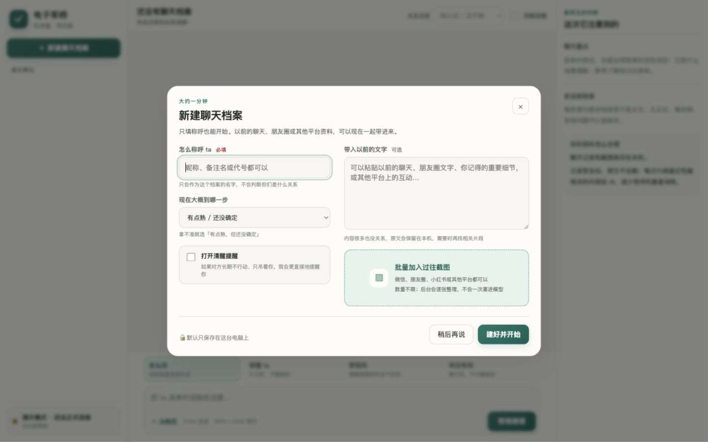
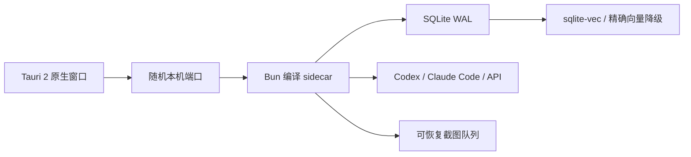
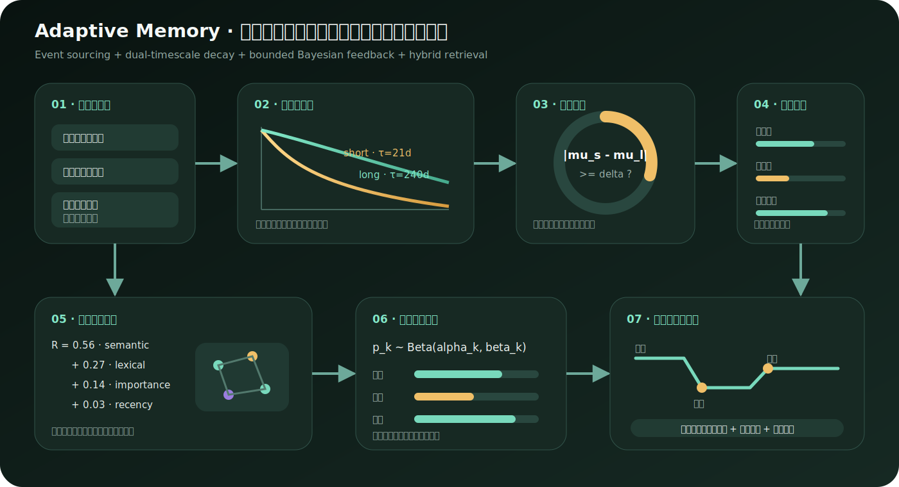

<div align="center">

# 电子军师

把聊天放进来，先读懂，再回复。

现在是一个完整的本地桌面 App：能批量读过往截图，记住很久以前的重要细节，也会根据真实后续慢慢修正判断。

[](docs/releases/v4.0.0.md)
[](#下载安装)
[](#资料和隐私)
[](README_EN.md)

</div>


## 下载安装

打开 [GitHub Releases](https://github.com/shoal-rat/dianzi-junshi/releases/latest)，下载自己电脑对应的安装包：

| 电脑 | 下载哪个 |
| --- | --- |
| Windows 10 / 11 | 名字以 `setup.exe` 结尾的文件 |
| Apple Silicon Mac | 名字含 `aarch64` 的 DMG |
| Intel Mac | 名字含 `x64` 的 DMG |
| Ubuntu / Debian | DEB；其他 Linux 可用 AppImage |

双击安装即可。普通用户不用安装 Bun、Node.js、Rust 或数据库，也不用打开终端。更详细的步骤见 [安装说明](INSTALL.md) 和 [新手指南](docs/新手指南.md)。


## 第一次打开

1. 给正在聊天的人写一个称呼或代号。
2. 选择大概的关系进度；拿不准就保留默认项。
3. 可以粘贴以前的聊天或备注，也可以一次选择一整批截图。
4. 选择 AI 连接，然后像平时说话一样问「这句怎么回」。

截图数量没有产品设置的固定上限。文件会逐个保存，AI 在后台一张张整理，并显示进度。磁盘空间和所选 AI 的额度仍然是实际边界。




## 不用在 App 里填 API Key

如果电脑上已经登录 Codex 或 Claude Code，桌面 App 会自动找到它们并复用登录状态：

| 连接 | 第一次准备 | App 的安全边界 |
| --- | --- | --- |
| Codex | 安装后运行一次 `codex login` | 临时会话、只读沙箱 |
| Claude Code | 安装后运行一次 `claude auth login` | 没有图片时禁用工具；看图时只开放档案目录读取 |

也可以在 App 里连接 Claude、DeepSeek、GLM 或兼容 OpenAI 格式的 API。“不用另填 Key”不等于免费，仍会使用对应账号的套餐额度。Codex 连接说明见 [桌面 App 连接 Codex](platforms/codex.md)。

## 它会做什么

- **怎么回**：解释语气，给 2–3 种短、自然、能直接复制的说法。
- **读懂 ta**：只分析，不替你生成回复。
- **帮我改**：把你准备发的话改得更像真人随手打的。
- **有没有戏**：把甜话、主动性、承诺和实际行动分开看。
- **清醒提醒**：长期不行动、只画饼或持续敷衍时，说得更直接。
- **批量资料**：过往聊天、朋友圈、小红书等平台的截图可以整批导入。
- **结果学习**：发送建议后记录 ta 的真实反应，下一次判断会有边界地调整。

它不会声称知道另一个人的内心，也不会因为一次结果给人贴永久标签。

## 很久以前的资料怎么找回来

每张截图会成为一张可解释的记忆卡：摘要、可核对事实、人物、时间、关键词、重要度、向量和来源原图。当前问题会经过混合检索：

```text
语义向量 + 全文关键词 + 重要度 + 很弱的时间衰减 + 相关记忆链接
```

因此几个月前的明确约定可以排在昨天的普通闲聊前面。SQLite 是实时索引，`sqlite-vec` 可用时负责本机向量搜索；无法加载原生扩展时自动使用精确余弦检索。摘要可能遗漏信息，所以原始截图永远保留。


## 判断怎么跟着人一起变化

人的习惯会变，所以 v4 不维护一张永远不动的“性格总结”。它保存每一次真实结果，再同时计算：

- 最近约 3 周的短期状态；
- 约 8 个月尺度的长期习惯；
- 两者是否出现足够可信的偏离；
- 短句、提问、玩笑、直接表达、邀约等策略的实际结果。

旧证据会逐渐衰减，重复出现的结果才会提高置信度。画像检测到变化时优先参考近期状态；没有足够样本时会明确说“不急着下结论”。文字表态和实际行动各有独立证据权重，遇到“说得甜但总不兑现”的情况会更重视行动。

这套设计是事件溯源的：旧观察不会被新结论偷偷覆盖，可以区分“以前如此”和“最近变了”。实现见 [时间画像与结果学习](docs/时间画像与结果学习.md)。


## 资料和隐私

资料默认保存在：

```text
~/.dianzi-junshi/
├── config.json
├── memory.sqlite3             # 记忆、反馈和时间画像
└── partners/
    └── 某个称呼/
        ├── meta.json
        ├── messages.jsonl     # 可读的原始聊天记录
        ├── imports/           # 原始截图
        ├── material-memories.jsonl # SQLite 之外的恢复日志
        └── material-jobs/     # 可恢复的批量任务
```

- 桌面后端只监听一个随机的 `127.0.0.1` 端口，退出 App 时一同结束。
- 目录和文件尽量使用仅当前用户可访问的权限。
- 本机截图不会自动发送；只有进入逐张分析时才交给当前选择的 AI。
- 使用 API 时，Key 目前保存在本机配置文件，尚未接入系统钥匙串。
- 聊天内容仍会发送给你选择的 AI 服务，请遵守其隐私和工作区规则。

## 技术架构



- Tauri 2 使用系统 WebView，安装包比内置完整 Chromium 更轻。
- Bun sidecar 把现有 TypeScript 后端编译成独立可执行文件。
- SQLite WAL 提供事务、并发读取和崩溃恢复；无需独立数据库服务。
- 记忆检索将向量、全文、重要度、时间和轻量图关联混合重排。
- 反馈画像使用有界的 Beta 后验、双时间尺度指数衰减和变化检测，不让少量样本无限放大。

相关研究和工程来源：[PersonaMem](https://arxiv.org/abs/2504.14225)、[Memoria](https://arxiv.org/abs/2512.12686)、[A-MEM](https://arxiv.org/abs/2502.12110)、[RAPTOR](https://proceedings.iclr.cc/paper_files/paper/2024/hash/8a2acd174940dbca361a6398a4f9df91-Abstract-Conference.html)、[sqlite-vec](https://alexgarcia.xyz/sqlite-vec/) 和 [Tauri 2](https://v2.tauri.app/)。

## 开发和发布

后端验证：

```bash
cd app
bun install
bun run verify
```

在当前系统构建桌面安装包：

```bash
cd desktop
bun install
bun run build
```

推送 `v*` 标签后，GitHub Actions 会构建 Windows x64、macOS Apple Silicon / Intel、Linux x64 / ARM64 安装包，并创建 Draft Release。详见 [发布桌面安装包](docs/发布桌面安装包.md)。

## 版本说明

- [v4.0.0 · Adaptive Desktop](docs/releases/v4.0.0.md)
- [v3.1.0 · Deep Memory](docs/releases/v3.1.0.md)
- [完整更新记录](CHANGELOG.md)

## 附录：理论和数学（普通使用不用看）

下面是实现的简化数学表达。它不是给关系打分，而是限制系统什么时候可以相信“最近真的变了”。

每个观察 \(x_i\in[0,1]\) 带有置信度 \(c_i\) 和年龄 \(\Delta t_i\)。短期与长期轨道使用不同半衰期：

$$
w_i^{(\tau)}=c_i\,2^{-\Delta t_i/\tau},\qquad
\mu_{\tau}=\frac{\sum_i w_i^{(\tau)}x_i}{\sum_i w_i^{(\tau)}}
$$

其中 \(\tau_s=21\) 天，\(\tau_l=240\) 天。只有近期质量足够、且 \(|\mu_s-\mu_l|\ge 0.28\) 时，变化门 \(g\) 才打开。当前估计是两条轨道的有界混合：

$$
g=\mathbf 1\!\left[|\mu_s-\mu_l|\ge\delta\right]\left(1-e^{-M_s/\kappa}\right),\qquad
\lambda=0.38+0.34g,\qquad
\hat\theta=\lambda\mu_s+(1-\lambda)\mu_l
$$

对第 \(k\) 种表达策略，结果按 120 天尺度衰减后进入 Beta 后验。倍率还会受有效样本量限制，所以一两次好运或冷场不会让建议突然走向极端：

$$
p_k=\frac{\alpha_0+\sum_i d_i y_i}{\alpha_0+\beta_0+\sum_i d_i},\qquad
m_k=1+0.7(p_k-0.5)\left(1-e^{-N_k/5}\right)
$$

远期记忆使用可解释的混合排序；图关联只在高分种子附近做有限扩展：

$$
R(q,m)=0.56\cos(\mathbf e_q,\mathbf e_m)+0.27L(q,m)+0.14I(m)+\frac{0.03}{1+\operatorname{age}(m)/365}
$$



更完整的字段、边界与降级策略见 [时间画像与结果学习](docs/时间画像与结果学习.md)。

## 许可证

MIT，见 [LICENSE](LICENSE)。
