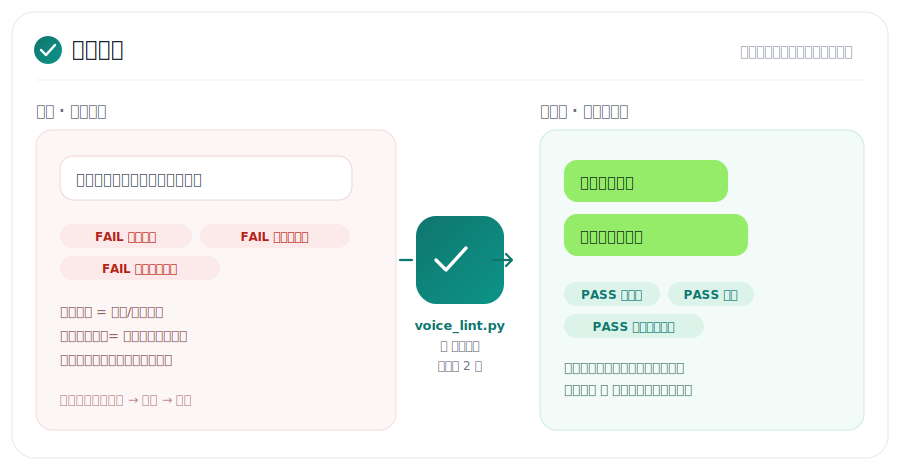
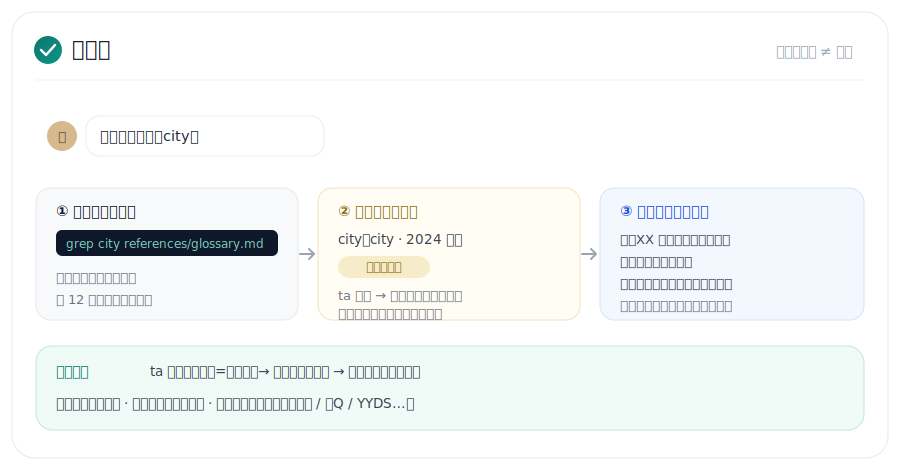
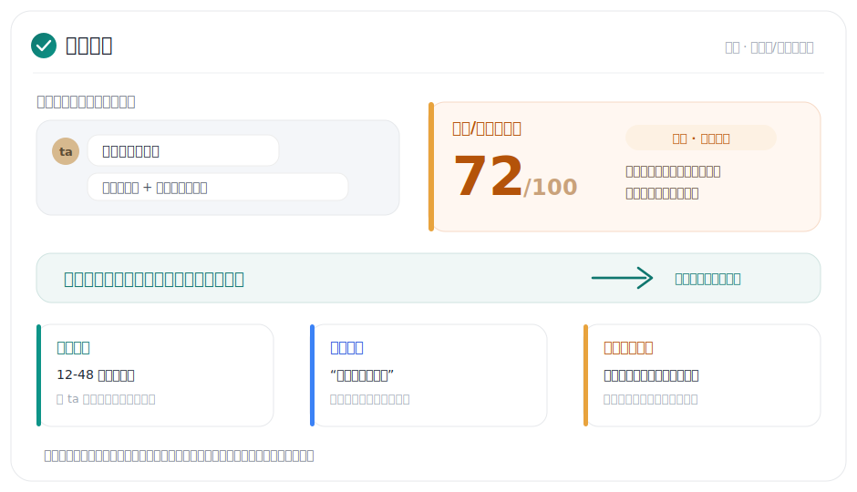

<div align="center">

# 电子军师

### 不会恋爱的人用的中文恋爱聊天 agent。

贴聊天截图，它帮你读懂 ta、判断有没有戏、给三条能发的回复；说出来的话像 2026 年的年轻人，不像长辈；遇到海王/海后，就切到拉扯打擂台。

[](LICENSE)
[](https://claude.ai/code)
[](platforms/codex.md)
[](README_EN.md)

</div>


> 想直接上手？跳到 [安装与上手](#安装与上手)，跟着粘命令就行。不会用终端也能照着来。

## 它适合谁

你可能不是不会喜欢人，而是卡在这些地方：

- 看不懂 ta 的回复到底有没有意思，甚至看不懂 ta 在玩什么梗。
- 想撩，但一不小心就油了、急了、或者说出来像个中年领导。
- 对方忽冷忽热、只撩不约、画饼，你不知道该继续还是收。
- 约成了，但不知道订什么、送不送花、怎么确认细节。
- 同时聊几个人，怕记混，也怕每次都从头解释。

电子军师的定位很简单：**先展示你自己，再低油腻地撩；对方接球就推进，不接就收；识别到海王/海后，就换打法。**

## v2 有什么新的

这一版整个重写了。两个核心变化：

**1. 说话不再像长辈。** 每条能发的回复都要过「人话门禁」：先跑 `tools/voice_lint.py`（句尾句号、"多喝热水"式叮嘱、正式连词、过气热梗、超长气泡——机器直接拦下），再过自检清单（像不像随手打的、像不像你本人），最多修两轮，过不了就明说卡在哪。



**2. 它开始懂梗了。** 每条对方的消息先过梗扫描——「那咋了」按字面读像不耐烦，按梗读是撒娇嘴硬，回错方向全盘皆输。内置一本按月标注新鲜度的梗词典（鲜活 / 日常化 / 陈旧 / 过气黑名单），不认识的梗上网查证后自动写回词典，越用越全。



其它升级：默认输出变轻（6 个字的玩笑不再裹进 60 行档案）、记忆改成「先记事件再升规则」防止一次巧合变成铁律、档案会定期自我压缩（留结论、折过程、归档原始记录）、25 个指令文件合并成 8 个。

## 核心能力

### 1. 看聊天，给能发的话

先扫梗，再拆 ta 那句话的字面、情绪和真实需求，然后给三种回复：稳妥版、会撩版、按场景的第三版。每条都标油腻度，超出阶段上限会自动压回去；每条都过人话门禁，保证发出去不穿帮。

### 2. 判断 ta 到底有没有意思


不给一个粗糙的兴趣分，拆成四维：聊天甜度、主动性、关系承诺、见面/行动兑现。甜话只算甜，行动才算数。v2 还加了「模仿度」信号：ta 开始复制你的语气词、句式和表情包，是数据上最强的好感证据。开了反舔狗模式，明显不值得加码时它会直接拉住你。

### 3. 反海王/海后：识别到就打擂台



不只看老式忽冷忽热，也看平台化信号：模板化高情绪价值、评论区暧昧、朋友圈定向投喂、多线排班、节日借势。置信度偏高就切换打法：降频观察、轻推回球、换时段测试、专属细节测试、邀约兑现测试。


### 4. 不同类型，不同追法

直球低敏、慢热低展示、审美仪式感、社交活跃、高选择权玩家型——按聊天和朋友圈证据分型，给拉扯强度 0-3。它还会描一层性格底色：对方吃"痞一点"还是"乖一点"，然后在**你本来就有的范围内**把对应的一面多放出来——不是给你造假人设。你从短视频看来想用的话术，丢进来帮你按阶段、气质、油腻度校准成像你本人会说的。

### 5. 朋友圈和小红书式展示，它会看图

朋友圈一半信息在图片里。截图丢进去，它看妆容、穿搭、滤镜、构图、评论区互动，提取话题、类型、约会地点和礼物线索。批量导入时每张图都留一条结构化记录，结论能回指到具体图片，不靠"看了很多图的感觉"。

### 6. 约到了，回复和旁白分开放


可复制回复只放能发给 ta 的话；旁白提醒只给你看：哪天订位、送不送花、520/七夕提前几周准备、现场怎么收尾。旁白里还有一份现场体验设计：顺着 ta 喜欢的、或流露过想试的事，安排一两个会被记住的小瞬间。

### 7. 多对象长期记忆，不串戏


每个对象一份独立档案：阶段、聊天习惯、哪招有效、海王置信度、梗偏好，全分开记，换窗口也能接上。记忆按「先记事件、再升规则」积累——一次逗笑不等于永远吃调侃，2-3 次一致才升级成规则；聊死的原句一次就进「再也不这样」清单。档案大了会自动提示压缩，留结论、归档过程，越用越准而不是越用越臃肿。

## 输出会长什么样

普通聊天，轻量直给：

```text
「那咋了」是撒娇式嘴硬，不是生气，接梗别讲理

方案 1 · 稳妥
没咋 羡慕的声音大了点

方案 2 · 会撩（油 1.5/5）
挺好 记住了
以后找你玩只敢约下午场

方案 3 · 整活
那咋了 我也爱赖床
咱俩谁也别笑话谁

推荐 3：她在玩梗频道，同款句式回敬同频感最强。
别这样回：讲睡懒觉对身体不好——一句话杀死一个梗，爹味瞬间拉满
```

遇到拉扯、低兴趣或海王信号，才升级成完整分析，并单独给策略框：

```text
┌ 策略
│ 回复间隔：1-4 小时
│ 消失建议：本轮收尾
│ 拉扯动作：轻推回球
│ 看反馈：ta 是否给时间地点，是否主动补细节
│ 回来反馈：发你实际发的版本、发送时间、ta 多久回、ta 回了什么
└
```

## 运行原理


1. **先扫梗**：对方的消息可能整句是个梗；查内置词典，不认识就上网查证，查到写回词典（循环一）。
2. **读局**：表面/情绪/真正想要三层解读，必要时四维兴趣分和玩家信号。
3. **定打法**：阶段定油腻度上限，类型定拉扯强度，气质定痞/乖频道。
4. **起草三版**，用对 ta 验证过有效的招，避开无效模式。
5. **人话门禁**：voice_lint 加自检清单，最多修两轮（循环二）。
6. **反馈写回记忆**：先记事件再升规则，档案定期压缩（循环三）。

## 安装与上手

完全没用过也没关系，照着做。


### 路线 A · Claude Code（推荐）

**第 1 步，装 Claude Code。**

- Windows：按 `Win + X`，点「终端」，粘这行回车：

  ```powershell
  irm https://claude.ai/install.ps1 | iex
  ```

- Mac：按 `Command + 空格`，打字「终端」回车打开，粘这行回车：

  ```bash
  curl -fsSL https://claude.ai/install.sh | bash
  ```

  装完按提示用 Claude 账号登录。

**第 2 步，把电子军师装成 Claude Skill。**

进入 claude code 后，复制以下命令：

```text
帮我把这个skill安装到claude code，让我可以开关：https://github.com/shoal-rat/dianzi-junshi
```

**第 3 步，开聊。** 输入 `claude` 回车，直接说「帮我追个人」。它会建档，然后你把微信截图丢进去。

> 每步长什么样、卡住怎么办，看[新手指南](docs/新手指南.md)。

### 路线 B · Codex

在 Codex 里，复制以下命令：

```text
帮我把这个skill安装到codex，让我可以开关：https://github.com/shoal-rat/dianzi-junshi
```

更多见 [platforms/codex.md](platforms/codex.md)。

## 平时怎么用

不用记命令，正常打字就行：

```text
（贴一张微信截图）这条我该怎么回
ta 这么说是什么意思，我还有戏吗
我想发「你是不是不想理我了」，行不行
感觉 ta 有点海后，帮我判断一下
ta 答应周末见面了，帮我安排一下
换个人，帮我新建个对象
```

习惯敲命令的话，`/reply`、`/interest`、`/moments`、`/date-plan`、`/anti-simp on`、`/memory compact` 这些它也认。

## 油腻度是什么

不是不让你甜，也不是不让你撩。油腻度只是提醒你：现在这段关系，信号给太满会不会把人吓跑。

| 阶段 | 大概上限 | 感觉 |
| --- | --- | --- |
| 初识 / 暧昧 | 0-1.5 / 5 | 有意思，但别露底 |
| 追求 / 确认 | 2-2.5 / 5 | 可以主动，别逼问 |
| 热恋 / 稳定 | 3-3.5 / 5 | 可以甜，别腻成复读机 |
| 磨合 / 危机 | 0.5-1.5 / 5 | 先降温，别上头 |

## 常见问题

**我电脑小白，连终端都没用过，能用吗？**
能。照路线 A 一步步粘命令就行，每条都给你写好了。

**它怎么保证说话不像长辈？**
硬规则 + 机器检查。句尾句号、"多喝热水"、正式连词、过气热梗（泰裤辣 / 栓Q / YYDS 这种）都会被 `tools/voice_lint.py` 直接拦下，改到过为止；过不了会明说卡在哪，让你定夺。

**梗词典会过时吗？**
每个条目带校验年月，超过一年要用时它会先上网复核；遇到不认识的新梗，查证后自动写回词典。ta 自己在用的梗永远可以跟——跟着对方玩梗永远不过时。

**粘命令报错，或者提示没有 git？**
Windows 先装 [Git](https://git-scm.com/downloads/win)，一路下一步，再回到安装步骤。

**装完它不理我，或者找不到？**
把 Claude Code 或 Codex 整个关掉再打开。新装的技能通常要重启才认得。

**怎么换对象？同时追好几个会不会乱？**
直接说「换人」或「新建」。每个人一份档案，各记各的。

## 许可证

MIT，见 [LICENSE](LICENSE)。
