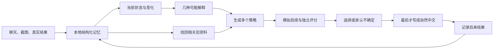

# 电子军师

把聊天贴进来。它会先想清楚，再帮你回。

[](docs/releases/v5.0.0.md)
[](desktop/README.md)
[](docs/新手指南.md)
[](app/decision.test.ts)

电子军师是一款桌面聊天辅助应用。你不需要会写提示词，也不需要先整理完整故事。贴一段文字或一批截图，它会找回相关旧资料，比较几种可能解释，再给出能直接发送的说法。资料默认保存在你的电脑上。

> 它帮助你整理信息和控制表达分寸，不替你诊断别人，也不保证关系结果。


## 三步开始


1. 新建一个聊天档案，只填昵称也可以。
2. 贴上聊天文字、截图或以前的资料。
3. 选一句顺口的，复制去发送。

第一次建档时可以一次选择任意数量的截图。应用逐个把文件写入磁盘，再让 AI 一张张整理，因此不会把整批图片同时塞进浏览器内存或模型上下文。进度可以收起，任务仍在后台继续；失败的单张图片可以单独重试。


## 下载与安装

打开仓库的 **Releases** 页面，下载适合电脑的安装包：

- macOS：`.dmg`
- Windows：`.msi` 或安装程序
- Linux：`.AppImage`、`.deb` 或 `.rpm`

安装包内已经包含应用后端。普通用户不需要安装 Node.js、Bun、Rust 或 Python。

如果当前版本还没有可下载的安装包，可以看 [安装说明](INSTALL.md) 或 [桌面构建说明](desktop/README.md)。Tauri 官方也说明了各平台安装包和签名要求：[Tauri distribution guide](https://v2.tauri.app/distribute/)。

## 不想填 API Key？可以

应用会检查这台电脑上是否已经安装并登录：

- **Codex**：复用现有 `codex login`
- **Claude Code**：复用现有 Claude Code 登录

选中后就能直接使用，电子军师不会读取或保存你的账号密码。本机命令在只读工作区运行；只有本次需要看的截图路径会开放给它。

也可以选择 Claude、DeepSeek、GLM 或自定义 OpenAI 兼容 API。API Key 保存在 macOS Keychain、Windows Credential Manager 或 Linux Secret Service，不写入 JSON 配置。旧版本留下的明文 Key 会在首次桌面启动时自动迁移。演示模式完全离线，用来先熟悉界面。


## 它和普通聊天机器人哪里不同

普通做法常常让一个模型同时读历史、猜状态、选策略、写文案。模型写得流畅，不代表判断过程可靠。

电子军师 v5 把这些工作拆开：



你可以在右侧展开“完整思考过程”，看到：

- 它目前有多确定
- 哪些解释仍在竞争
- 参考了什么证据
- 比较过哪些方案
- 为什么没有选其他方案
- 这次本地规划花了多久

默认界面不会用这些技术细节打扰你。


## 会记住很久以前的内容

原始消息和截图不会为了“压缩上下文”而删除。应用使用三层记忆：

1. 最近消息直接保留。
2. 较早内容按当前问题检索。
3. 截图生成带来源的记忆卡，并用本地向量与文字线索找回。

检索不只看“像不像”，还看可靠度、时间、重要性、过去是否真的帮助过决策，以及是否需要带回反例。时间事实有有效区间；两条可靠信息互相冲突时，两条都会留下。

这不是“无损摘要”的营销承诺。原文负责不丢失，结构化记忆负责定位，当前上下文只负责本轮决策。近期的 Codex 和 Claude 产品也在使用上下文压缩、外部记忆与主动上下文管理来延长任务，但本项目仍把可回指原文作为最终依据：[Codex compaction](https://openai.com/index/introducing-upgrades-to-codex/)、[Claude context management](https://www.anthropic.com/news/claude-opus-4-5)。

## 会学习，但不会把人定型

点“记录后来结果”，可以告诉它：

- ta 的反应是积极、中性、负面，还是一直没回
- 大约多久回复
- 有没有主动延续
- 约好的事情有没有做到
- 有没有记得以前的细节

每次结果都会关联当时的决策、策略和实际发送文案。系统分别观察短期变化和长期习惯；新结果的权重更高，旧结果缓慢衰减。一次失败不会把某种说法永久封禁，一次成功也不会变成万能公式。

右侧会显示各类策略的历史样本、带先验的成功估计和最近 30 天趋势。发现的互动模式拥有完整生命周期：样本不足、用于规划、继续观察、暂停使用或不适用。用户可以随时修改，系统不会偷偷恢复被停用的模式。

### 可选的真实结果校准

设置里可以明确选择“帮忙校准本机决策引擎”。它只记录开启之后的新反馈，并且只保存信念数值、假设概率、策略类型、预测分数和结果标签。姓名、档案 ID、聊天原文、回复文案和对方回复都不会进入校准表。

校准数据默认只在本机，可以导出审查或一键删除，不会自动上传。没有真实用户主动同意，就不会凭空出现所谓“真实世界数据集”。

## 对不熟悉电脑的人做了什么

- 按钮写“帮我想想”“加截图”“记录后来结果”，不要求理解模型术语。
- 每个弹窗都能用右上角、背景点击或 Esc 关闭。
- 错误信息会告诉你下一步怎么做，并保留刚才输入。
- 第一次只填昵称就能开始，其他资料可以以后补。
- 技术过程默认折叠，重要的不确定性会直接说人话。
- 支持减少动画偏好、键盘操作、清晰焦点和响应式布局。

界面文字遵循短句、日常词、主动语态和任务优先。这样的写法不只是“少一点 AI 味”，也更适合阅读困难、电脑经验少或使用翻译工具的人。参考：[GOV.UK plain-language principles](https://www.gov.uk/government/publications/govuk-content-principles-conventions-and-research-background/govuk-content-principles-conventions-and-research-background)、[Home Office guidance for limited English](https://design.homeoffice.gov.uk/design-and-content/content/designing-for-limited-english)。

## 隐私与边界

- 聊天、截图、索引和结果默认位于 `~/.dianzi-junshi/`。
- 每个聊天对象使用独立目录。
- API Key 使用操作系统凭据库；配置文件只保存“已有 Key”的标记。
- Codex / Claude Code 只读取允许的资料路径。
- 不内置云同步，也不会自动把资料发给仓库维护者。
- 使用云模型时，本轮选中的内容会发送给所选供应商，请同时阅读供应商隐私条款。

SQLite 使用 WAL，让桌面后台整理截图时仍能读取数据；WAL 适合单机并发，不适合把活动数据库放在网络文件系统上。详见 [SQLite WAL documentation](https://www.sqlite.org/wal.html)。

## 开发

需要 Bun 1.3+：

```bash
git clone https://github.com/shoal-rat/dianzi-junshi.git
cd dianzi-junshi/app
bun install --frozen-lockfile
bun run start
```

验证全部后端、前端打包、测试和离线评测：

```bash
cd app
bun run verify
```

当前验证包含 11 个单元与集成测试，以及一组合成决策情境。离线评测不调用模型，也不读取真实用户资料。

桌面开发：

```bash
cd desktop
bun install --frozen-lockfile
bun run dev
```

GitHub Actions 会在 macOS、Windows 和 Linux 上分别构建原生安装包。正式公开发布前仍应配置 Apple 公证和 Windows 签名证书。

## 文档

- [新手指南](docs/新手指南.md)
- [批量素材与长期记忆](docs/批量素材与长期记忆.md)
- [自适应决策引擎](docs/adaptive-decision-engine.md)
- [本地决策流水线](docs/local-decision-pipeline.md)
- [数据库迁移与回放](docs/database-migrations.md)
- [决策引擎评测](docs/decision-engine-evaluation.md)
- [隐私校准与系统凭据库](docs/privacy-calibration-and-keychain.md)
- [桌面签名、公证与原生 CI](docs/release-signing.md)
- [v5.0.0 发行说明](docs/releases/v5.0.0.md)
- [更新记录](CHANGELOG.md)

## 技术结构

| 层 | 实现 |
|---|---|
| 桌面外壳 | Tauri 2 |
| 本地服务 | Bun 编译 sidecar + Server-Sent Events 流式响应 |
| 数据 | SQLite WAL + 追加事件 + 版本迁移 |
| 证据图 | 时间节点 + supports / contradicts / precedes / outcome_of 等有效期关系 |
| 长期检索 | sqlite-vec 可选加速 + 本地混合检索回退 |
| 决策 | 双时间尺度信念、竞争假设、VOI、有限世界模型、多批评器 |
| 学习 | 时间衰减 Beta contextual bandit + 证据用途反馈 |
| 校准 | 明确同意、去标识化、本地导出/撤回、Brier 与分箱校准误差 |
| 模型 | Codex、Claude Code、Claude、DeepSeek、GLM、自定义 API、离线演示 |
| 前端 | 无框架 HTML / CSS / JavaScript |

## 理论附录：它在优化什么

以下公式描述实现思路，放在这里供想深入研究的人阅读；使用应用不需要懂数学。

### 1. 双时间尺度信念

对状态维度 $d$，观察 $x_i \in [-1,1]$ 的时间权重为：

$$
w_i^{(\tau)} = c_i r_i 2^{-\Delta t_i / \tau},
\qquad
\mu_d^{(\tau)} =
\frac{\sum_i w_i^{(\tau)}x_i}{\sum_i w_i^{(\tau)}}
$$

其中 $c_i$ 是观察置信度，$r_i$ 是来源可靠度，$\tau_s=21$ 天表示短期，$\tau_l=240$ 天表示长期。变化强度为：

$$
\Delta_d = \left|\mu_d^{(\tau_s)}-\mu_d^{(\tau_l)}\right|,
\qquad
\hat\mu_d = \alpha_d\mu_d^{(\tau_s)}+(1-\alpha_d)\mu_d^{(\tau_l)}
$$

只有有效样本量和差异同时越过门槛时，$\alpha_d$ 才增大。这样既能跟上变化，也不会被一次情绪波动带跑。

### 2. 决策用途检索

证据 $e$ 对当前问题 $q$ 的分数不是单一向量相似度：

$$
S(e\mid q)=
\lambda_1 s_{sem}+
\lambda_2 s_{lex}+
\lambda_3 s_{time}+
\lambda_4 s_{rel}+
\lambda_5 s_{use}+
\lambda_6 s_{contra}-
\lambda_7 s_{dup}
$$

$s_{contra}$ 奖励能检验当前结论的反证，$s_{dup}$ 惩罚重复内容。最终集合还受类别配额约束，避免十条证据都来自同一张截图。

### 3. 竞争假设与不确定性

状态假设 $h_k$ 使用 softmax 保留为分布：

$$
p(h_k\mid E)=\frac{\exp z_k}{\sum_j\exp z_j},
\qquad
H(H)=-\frac{\sum_k p_k\log p_k}{\log |H|}
$$

总体不确定性由状态熵、证据冲突、模拟方差、候选分差和证据覆盖共同组成：

$$
U = 0.31H + 0.20C + 0.19V + 0.18(1-G) + 0.12(1-M)
$$

当 $U$ 高且覆盖 $G$ 低时，引擎选择追问或可逆策略，而不是输出一个语气很确定的猜测。

### 4. 策略学习与探索

对情境 $c$ 中的策略 $a$，结果 $y_t\in[0,1]$ 更新带衰减的 Beta 后验：

$$
\begin{aligned}
\alpha_{t}^{c,a} &= \alpha_0 + \rho_t(\alpha_{t-1}^{c,a}-\alpha_0)+y_t,\\
\beta_{t}^{c,a} &= \beta_0 + \rho_t(\beta_{t-1}^{c,a}-\beta_0)+(1-y_t),\\
\rho_t &= 2^{-\Delta t/120}
\end{aligned}
$$

最终策略效用同时考虑即时结果、长期结果、信息增益、自然度和风险：

$$
Q(a)=
\mathbb E_{h\sim p(H\mid E)}
\left[
0.29R_g+0.14R_e+0.13R_c+0.15R_n+0.12I-0.22\mathcal R
\right]
+0.10\frac{\alpha^{c,a}}{\alpha^{c,a}+\beta^{c,a}}
+\frac{\eta}{\sqrt{N_{c,a}+1}}
$$

最后一项是有界探索奖励。样本越多，它越小；因此系统能尝试新方案，但不会为了“探索”长期拿用户冒险。

### 5. 是否值得再问一句

澄清问题的近似信息价值为：

$$
\operatorname{VOI}(q)=
\mathbb E_{o\sim p(o\mid q,E)}
\left[\max_a Q(a\mid E,o)\right]
-\max_a Q(a\mid E)
-C_{ask}(q)
$$

只有预期决策改善超过提问成本时，系统才先补信息。目标不是问得更多，而是用最少的一问区分最重要的两种解释。

---

MIT License · 欢迎提交 issue、测试案例和改进建议。
