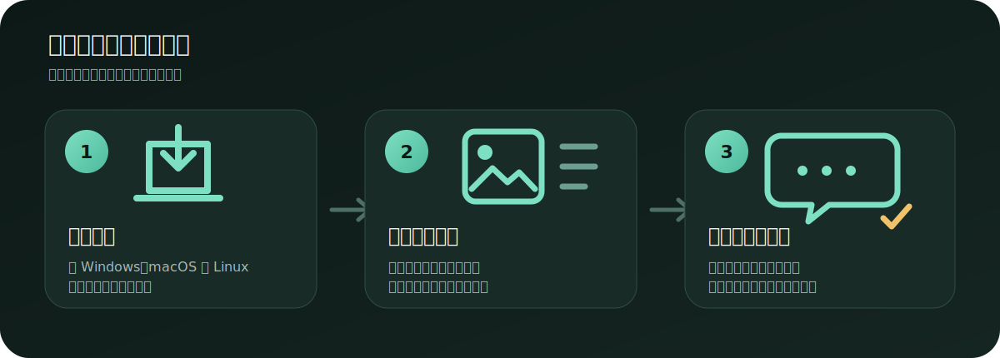
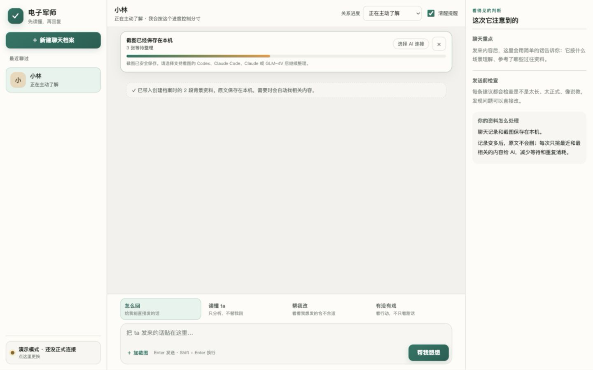
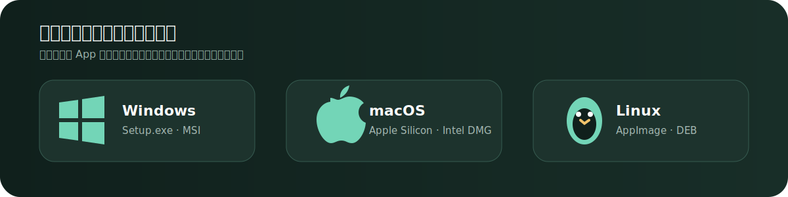
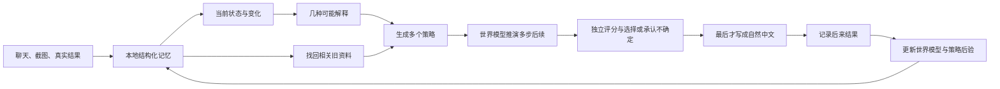
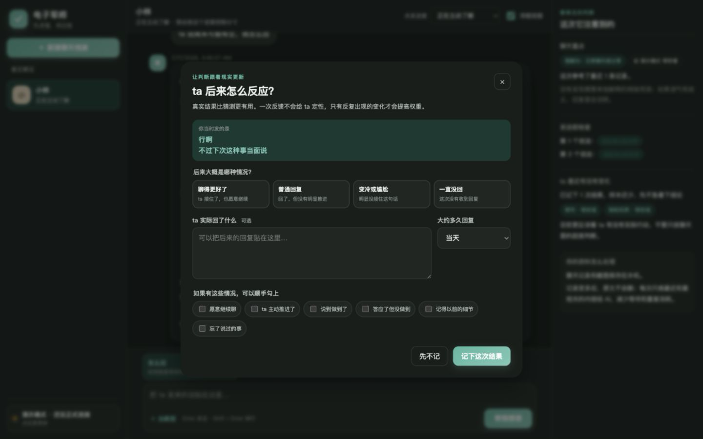

# 电子军师

把聊天贴进来。它会先想清楚，再帮你回。

[](docs/releases/v5.1.0.md)
[](desktop/README.md)
[](docs/新手指南.md)
[](app/decision.test.ts)

电子军师是一款桌面聊天辅助应用。你不需要会写提示词，也不需要先整理完整故事。贴一段文字或一批截图，它会找回相关旧资料，比较几种可能解释，再给出能直接发送的说法。资料默认保存在你的电脑上。


## 三步开始



1. 新建一个聊天档案，只填昵称也可以。
2. 贴上聊天文字、截图或以前的资料。
3. 选一句顺口的，复制去发送。

第一次建档时可以一次选择任意数量的截图。应用逐个把文件写入磁盘，再让 AI 一张张整理，内存和模型上下文占用与图片总量无关。进度可以收起，任务仍在后台继续；失败的单张图片可以单独重试。



## 下载与安装

打开仓库的 **Releases** 页面，下载适合电脑的安装包：

- macOS：`.dmg`
- Windows：`.msi` 或安装程序
- Linux：`.AppImage`、`.deb` 或 `.rpm`

安装包内已经包含应用后端。普通用户不需要安装 Node.js、Bun、Rust 或 Python。

如果当前版本还没有可下载的安装包，可以看 [安装说明](INSTALL.md) 或 [桌面构建说明](desktop/README.md)。Tauri 官方也说明了各平台安装包和签名要求：[Tauri distribution guide](https://v2.tauri.app/distribute/)。

## 不想填 API Key？可以

应用会检查这台电脑上是否已经安装并登录：

- **Codex**：复用现有 `codex login`
- **Claude Code**：复用现有 Claude Code 登录

选中后就能直接使用，电子军师不会读取或保存你的账号密码。本机命令在只读工作区运行；只有本次需要看的截图路径会开放给它。

也可以选择 Claude、DeepSeek、GLM 或自定义 OpenAI 兼容 API。API Key 保存在 macOS Keychain、Windows Credential Manager 或 Linux Secret Service，不写入 JSON 配置。旧版本留下的明文 Key 会在首次桌面启动时自动迁移。演示模式完全离线，用来先熟悉界面。



## 它和普通聊天机器人哪里不同

普通做法常常让一个模型同时读历史、猜状态、选策略、写文案，判断过程混在一次生成里，无法单独检查。

电子军师 v5 把这些工作拆开，每一步都可检查：



你可以在右侧展开“完整思考过程”，看到：

- 它目前有多确定
- 哪些解释仍在竞争
- 参考了什么证据
- 比较过哪些方案
- 为什么没有选其他方案
- 这次本地规划花了多久

这些技术细节默认折叠，主界面保持简洁。




## 会记住很久以前的内容

原始消息和截图全程保留。应用使用三层记忆：

1. 最近消息直接保留。
2. 较早内容按当前问题检索。
3. 截图生成带来源的记忆卡，并用本地向量与文字线索找回。

检索综合语义相似度、可靠度、时间、重要性、过去是否真的帮助过决策，以及是否需要带回反例。时间事实有有效区间；两条可靠信息互相冲突时，两条都会留下。

原文负责完整留存，结构化记忆负责定位，当前上下文只负责本轮决策。近期的 Codex 和 Claude 产品也在使用上下文压缩、外部记忆与主动上下文管理来延长任务，本项目把可回指原文作为最终依据：[Codex compaction](https://openai.com/index/introducing-upgrades-to-codex/)、[Claude context management](https://www.anthropic.com/news/claude-opus-4-5)。

## 从真实结果中学习

点“记录后来结果”，可以告诉它：

- ta 的反应是积极、中性、负面，还是一直没回
- 大约多久回复
- 有没有主动延续
- 约好的事情有没有做到
- 有没有记得以前的细节

每次结果都会关联当时的决策、策略和实际发送文案。系统分别观察短期变化和长期习惯；新结果的权重更高，旧结果缓慢衰减。单次结果只小幅调整估计，重复出现的结果才形成稳定模式。

因为每份决策报告都保存了世界模型当时的预测分布，真实结果同时是一份评分数据：引擎会更新对应情境的响应频率、修正状态转移的残差，并持续对比“模型预测”与“基础频率”的对数损失。模型只有在真的比基础频率更准时，学到的参数才占据更大权重。

右侧会显示各类策略的历史样本、带先验的成功估计和最近 30 天趋势。发现的互动模式拥有完整生命周期：样本不足、用于规划、继续观察、暂停使用或不适用。用户可以随时修改，修改结果持久生效。

### 可选的真实结果校准

设置里可以明确选择“帮忙校准本机决策引擎”。它只记录开启之后的新反馈，并且只保存信念数值、假设概率、策略类型、预测分数和结果标签。姓名、档案 ID、聊天原文、回复文案和对方回复都不会进入校准表。

校准数据只保存在本机，可以导出审查或一键删除。

## 对不熟悉电脑的人做了什么

- 按钮写“帮我想想”“加截图”“记录后来结果”，不要求理解模型术语。
- 每个弹窗都能用右上角、背景点击或 Esc 关闭。
- 错误信息会告诉你下一步怎么做，并保留刚才输入。
- 第一次只填昵称就能开始，其他资料可以以后补。
- 技术过程默认折叠，重要的不确定性会直接说人话。
- 支持减少动画偏好、键盘操作、清晰焦点和响应式布局。

界面文字遵循短句、日常词、主动语态和任务优先，对阅读困难、电脑经验少或使用翻译工具的人同样友好。参考：[GOV.UK plain-language principles](https://www.gov.uk/government/publications/govuk-content-principles-conventions-and-research-background/govuk-content-principles-conventions-and-research-background)、[Home Office guidance for limited English](https://design.homeoffice.gov.uk/design-and-content/content/designing-for-limited-english)。

## 隐私与边界

- 聊天、截图、索引和结果默认位于 `~/.dianzi-junshi/`。
- 每个聊天对象使用独立目录。
- API Key 使用操作系统凭据库；配置文件只保存“已有 Key”的标记。
- Codex / Claude Code 只读取允许的资料路径。
- 不内置云同步，也不会自动把资料发给仓库维护者。
- 使用云模型时，本轮选中的内容会发送给所选供应商，请同时阅读供应商隐私条款。

SQLite 使用 WAL，让桌面后台整理截图时仍能读取数据；WAL 适合单机并发，不适合把活动数据库放在网络文件系统上。详见 [SQLite WAL documentation](https://www.sqlite.org/wal.html)。

## 开发

需要 Bun 1.3+：

```bash
git clone https://github.com/shoal-rat/dianzi-junshi.git
cd dianzi-junshi/app
bun install --frozen-lockfile
bun run start
```

验证全部后端、前端打包、测试和离线评测：

```bash
cd app
bun run verify
```

当前验证包含 18 个单元与集成测试，以及一组合成决策情境。离线评测不调用模型，也不读取真实用户资料。

桌面开发：

```bash
cd desktop
bun install --frozen-lockfile
bun run dev
```

GitHub Actions 会在 macOS、Windows 和 Linux 上分别构建原生安装包。正式公开发布前仍应配置 Apple 公证和 Windows 签名证书。

## 文档

- [新手指南](docs/新手指南.md)
- [批量素材与长期记忆](docs/批量素材与长期记忆.md)
- [自适应决策引擎](docs/adaptive-decision-engine.md)
- [本地决策流水线](docs/local-decision-pipeline.md)
- [数据库迁移与回放](docs/database-migrations.md)
- [决策引擎评测](docs/decision-engine-evaluation.md)
- [隐私校准与系统凭据库](docs/privacy-calibration-and-keychain.md)
- [桌面签名、公证与原生 CI](docs/release-signing.md)
- [v5.0.0 发行说明](docs/releases/v5.0.0.md)
- [更新记录](CHANGELOG.md)

## 技术结构

| 层 | 实现 |
|---|---|
| 桌面外壳 | Tauri 2 |
| 本地服务 | Bun 编译 sidecar + Server-Sent Events 流式响应 |
| 数据 | SQLite WAL + 追加事件 + 版本迁移 |
| 证据图 | 时间节点 + supports / contradicts / precedes / outcome_of 等有效期关系 |
| 长期检索 | BM25 + 特征哈希向量余弦，Reciprocal Rank Fusion 融合；sqlite-vec 可选加速 |
| 决策 | 双时间尺度信念、竞争假设、学习型世界模型（体制切换动力学 + 校准响应头 + 信念空间回溯）、模型化 EVOI、多批评器 |
| 学习 | 世界模型响应计数 / 转移残差 / 对数损失门控 + 时间衰减 Beta contextual bandit + 证据用途反馈 |
| 结构化输出 | API 级约束解码（Anthropic 强制 tool schema / OpenAI 兼容 response_format），失败才回退提示修复 |
| 校准 | 明确同意、去标识化、本地导出/撤回、Brier 与分箱校准误差 |
| 模型 | Codex、Claude Code、Claude、DeepSeek、GLM、自定义 API、离线演示 |
| 前端 | 无框架 HTML / CSS / JavaScript |

## 理论附录：它在优化什么

以下内容完整描述 v5.1 决策引擎实现的数学结构。每个公式都对应仓库中的具体代码（主要在 `app/decision/worldmodel.ts`、`state.ts`、`evidence.ts`、`planner.ts`、`store.ts`），不是愿景描述。

### 0. 问题的形式化：部分可观测决策过程

引擎把一段关系中的每次回复决策建模为 POMDP $(\mathcal S,\mathcal A,\mathcal O,T,Z,r,\gamma)$：

- 潜状态 $s\in[-1,1]^9$：九个关系维度（投入、信任、沟通意愿、情绪压力、边界敏感、承诺可靠、势头、主动、一致性）。真实心理状态不可直接观测。
- 离散体制 $h\in\mathcal H=\{\text{receptive},\text{uncertain},\text{pressured},\text{disengaging}\}$：同一动作在不同体制下有不同动力学（第 3 节）。
- 动作 $a\in\mathcal A$：九类策略族，经特征映射 $\phi:\mathcal A\to\mathbb R^6$ 嵌入连续动作空间。
- 观测 $o\in\mathcal O=\{\text{positive},\text{neutral},\text{negative},\text{no\_reply}\}$：与可记录的真实结果一一对应，因此模型的预测分布可以被后验直接打分（第 8 节）。
- 折扣 $\gamma=0.68$，规划视界 $D\in\{1,2,3\}$ 由预算档位决定。

信念是混合形式 $b=\big(q(h),\,\mathcal N(\mu,\Sigma)\big)$：体制上的分类分布乘以对角高斯。理论最优解满足信念空间 Bellman 方程

$$
V_D(b)=\max_{a}\;\mathbb E_{h\sim q}\,\mathbb E_{o\sim Z(\cdot\mid s',h,a)}
\Big[r(o,b'') + \gamma\,V_{D-1}\big(\tau(b,a,o)\big)\Big],
$$

其中 $\tau$ 是信念更新算子。连续状态 + 连续信念使精确求解不可行；引擎采用滚动时域近似：根节点对 $o$ 做精确枚举分支，深层用确定性等价延拓（第 6 节）。

### 1. 观察融合：异方差遗忘估计与双时间尺度门控

维度 $d$ 上的观察 $x_i$ 带置信度 $c_i$、来源可靠度 $r_i$ 与年龄 $\Delta t_i$（天）。把每条观察视作异方差高斯测量 $x_i\sim\mathcal N(s_d,\lambda_i^{-1})$，精度 $\lambda_i\propto c_ir_i$，非平稳性用遗忘因子处理：

$$
w_i^{(\tau)} = c_i r_i\, 2^{-\Delta t_i/\tau},\qquad
\mu_d^{(\tau)}=\frac{\sum_i w_i^{(\tau)}x_i}{\sum_i w_i^{(\tau)}},\qquad
\hat\sigma_d^{2}=\frac{\sum_i w_i(x_i-\mu_d)^2}{\sum_i w_i}.
$$

$\mu_d^{(\tau)}$ 是遗忘加权似然下的 MAP 位置估计；$\tau_s=21$ 与 $\tau_l=240$ 天给出两个互补估计器。变化门控是一个硬专家混合：仅当短期有效样本量 $N^{(s)}_{\mathrm{eff}}=\sum_i w_i^{(\tau_s)}$ 与偏移 $|\mu^{(\tau_s)}-\mu^{(\tau_l)}|$ 同时越过阈值时，短期权重才从 0.38 升到 0.72：

$$
\hat\mu_d=\alpha_d\,\mu_d^{(\tau_s)}+(1-\alpha_d)\,\mu_d^{(\tau_l)},\qquad
\alpha_d\in\{0.38,\,0.72\}.
$$

进入规划前，方差按有效样本量做后验收缩（越多独立证据越确定，但设下界防止对人过度自信）：

$$
\tilde\sigma_d^{2}=\max\!\Big(0.04,\;\frac{\hat\sigma_d^{2}}{1+0.55\,N_{\mathrm{eff}}}\Big).
$$

### 2. 检索：BM25 ⊕ 特征哈希嵌入 ⊕ 倒数排名融合

候选证据 $e$ 相对本轮问题 $q$ 经三路独立排序后融合。

词法路是 Okapi BM25（文档频率在候选集内在线计算，$k_1=1.4$，$b=0.6$）：

$$
s_{\mathrm{lex}}(q,e)=\sum_{t\in q}
\ln\!\Big(1+\frac{N-n_t+0.5}{n_t+0.5}\Big)\cdot
\frac{f_{t,e}\,(k_1+1)}{f_{t,e}+k_1\big(1-b+b\,\tfrac{|e|}{\overline{|e|}}\big)}.
$$

语义路使用带符号特征哈希嵌入（Johnson–Lindenstrauss 式随机投影草图）：token $t$ 经 FNV-1a 哈希落入 384 维中的一个桶，符号由哈希最高位决定，随后 $L_2$ 归一化；相似度取余弦正部。先验路综合时间半衰（120 天）、可靠度、重要性与历史用途后验均值 $\frac{u+1}{u+v+2}$（Beta 平滑）。

三路排名用 Reciprocal Rank Fusion 合并（$k=60$，权重 $1,1,0.8$）：

$$
S(e)=\sum_{r\in\{\mathrm{lex},\mathrm{sem},\mathrm{prior}\}}\frac{w_r}{k+\mathrm{rank}_r(e)}.
$$

选择阶段做 MMR 式冗余抑制（与已选证据嵌入余弦 $>0.82$ 即跳过，反证豁免）、类别配额 $\lceil 0.55L\rceil$ 与反证覆盖，保证进入规划的证据既相关又多样。

### 3. 世界模型 I：体制切换线性高斯动力学

给定体制 $h$ 与动作特征 $\phi(a)\in\mathbb R^6$（soothe、advance、warmth、probe、assert、withdraw），下一状态服从

$$
s_{t+1}\mid h,a\;\sim\;\mathcal N\!\Big((I-\Lambda)s_t+\Lambda\bar s+G_h\,\phi(a)+\delta_{h,f}\,,\;Q\Big),
$$

- $\Lambda=\mathrm{diag}(\lambda_d)$ 是各维度的均值回复率（情绪压力回复快 $\lambda=0.30$，承诺可靠几乎不动 $\lambda=0.02$），基线 $\bar s=0$；
- 体制增益 $G_h = M_h\odot G_0 + R_h$：基础增益矩阵 $G_0$ 被体制逐列缩放（$M_h$），再叠加稀疏带符号修正 $R_h$——例如 pressured 体制下 advance 对 emotional_pressure 的增益额外 $+0.30$、对 momentum 额外 $-0.24$，这正是"压力大时推进适得其反"的动力学表达；
- $\delta_{h,f}$ 是从真实结果学到的每档案转移残差（第 8 节），以 $\frac{n}{n+8}$ 收缩权重生效；
- 协方差沿对角线性传播：$\Sigma'=(I-\Lambda)\Sigma(I-\Lambda)^\top+Q$。

### 4. 世界模型 II：校准响应头

回应分布是结构头与经验头的收缩混合。结构头是预测状态上的对数线性模型：

$$
p_0(o\mid s')=\frac{\exp\!\big(u_o^\top s'+c_o\big)}{\sum_{o'}\exp\!\big(u_{o'}^\top s'+c_{o'}\big)};
$$

经验头是按（体制, 策略族）分桶、按 120 天半衰期衰减计数的 Dirichlet–多项后验预测（$\alpha_0=0.75$）：

$$
\hat p(o\mid h,f)=\frac{n_{h,f,o}+\alpha_0}{\sum_{o'}n_{h,f,o'}+4\alpha_0}.
$$

混合闸门随经验证据量增长：$w=\frac{n}{n+6}$，

$$
p(o\mid s',h,f)=(1-w)\,p_0(o\mid s')+w\,\hat p(o\mid h,f).
$$

零数据时是纯结构先验，几十条真实结果后经验频率主导——这是小样本条件下唯一诚实的标定方式。

### 5. 想象观测的信念更新

每个回应类别 $o$ 携带观测向量 $y_o$ 与观测噪声 $R_o=\mathrm{diag}(r_{o,d})$（例如 no_reply 强烈观测到投入与沟通意愿为负）。对角卡尔曼增益逐维更新：

$$
k_d=\frac{\sigma_d'^2}{\sigma_d'^2+r_{o,d}},\qquad
\mu_d''=\mu_d'+k_d\,(y_{o,d}-\mu_d'),\qquad
\sigma_d''^2=(1-k_d)\,\sigma_d'^2.
$$

同时体制后验按 Bayes 更新——想象中的回应也会改变"哪种解释成立"的信念：

$$
q(h\mid o,a)=\frac{Z(o\mid s'_h,h,a)\,q(h)}{\sum_{h'}Z(o\mid s'_{h'},h',a)\,q(h')}.
$$

这一步让第 7 节的信息价值不再是启发式：追问的价值恰恰来自 $q(h\mid o)$ 与 $q(h)$ 的差。

### 6. 有限视界值回溯与风险

奖励由回应效用与状态势函数组成：$r(o,b'')=0.58\,u(o)+0.42\,v(\mu'')$，其中 $u=\{1,0.55,0.08,0.15\}$ 与结果记录的效用一致，$v$ 是线性状态效用叠加压力铰链项：

$$
v(\mu)=\mathrm{clip}_{[0,1]}\Big(\tfrac12\big(\langle w_v,\mu\rangle-0.25\max(0,\mu_{\mathrm{pressure}}-0.5)+1\big)\Big).
$$

根节点（深度 $D$）对回应精确枚举：

$$
Q_D(b,a\mid h)=\sum_{o}p(o\mid s'_h,h,a)\Big[r(o,b''_o)+\gamma\,\tilde V_{D-1}\big(b''_o,\;q(\cdot\mid o,a)\big)\Big];
$$

深层用确定性等价延拓：在缩减动作集 $\mathcal A_c$ 上贪心、以期望观测折叠分支：

$$
\tilde V_d(b,q)=\max_{a\in\mathcal A_c}\sum_h q(h)\Big[\rho(b,h,a)+\gamma\,\tilde V_{d-1}\big(\bar\tau(b,h,a),q\big)\Big],
\qquad \tilde V_0(b)=v(\mu).
$$

值按视界质量 $m(D)=\sum_{k<D}\gamma^k+\gamma^D$ 归一化到 $[0,1]$。每个分支同时给出全方差分解（用于第 9 节的不确定性泛函）：回应随机性的分支内方差加体制分歧的分支间方差，即 $\mathrm{Var}=\mathbb E_h[\mathrm{Var}_o]+\mathrm{Var}_h(\mathbb E_o)$。

风险不再是常数表，而是模型量的函数——负面/失联概率加上压力越界的高斯尾概率（$\Phi$ 用 Abramowitz–Stegun erf 近似求值）：

$$
\mathrm{risk}=0.9\,p(\mathrm{neg})+0.7\,p(\mathrm{no\_reply})
+0.5\,\Phi\!\Big(\frac{\mu'_{\mathrm{pressure}}-0.6}{\sigma'_{\mathrm{pressure}}}\Big).
$$

### 7. 追问的期望信息价值（EVOI）

"是否值得先问一句"按定义计算而非打分。以 clarify 为探针动作，枚举其回应类别，经第 5 节的体制 Bayes 更新后重新求最优单步值：

$$
\mathrm{EVOI}=
\underbrace{\sum_o p(o)\,\max_a\sum_h q(h\mid o)\,Q_1(b''_o,a\mid h)}_{\text{先问后决策}}
\;-\;
\underbrace{\max_a\sum_h q(h)\,Q_1(b,a\mid h)}_{\text{现在就决策}}.
$$

实际入库值再乘可回答性系数 $0.5+0.5\min(1,m/3)$（$m$ 为缺失信息条数——用户只能回答确实缺的问题），减去档位相关的提问成本。EVOI 是 $[0,1]$ 值域上的绝对改善量，超过 0.02 才生成"先补信息"候选。由 Bayes 更新的凸性可知 EVOI 恒非负（信息永不减少期望值），成本项是让它"值得打扰用户"的那道门槛。

### 8. 从真实结果学习：三条同时更新的通道

每份决策报告持久化了当时的预测分布，因此一条真实结果 $(h^\*,f^\*,o^\*)$ 同时更新：

**(a) 响应计数**（Dirichlet 通道）：$n_{h,f,o}\leftarrow \rho\, n_{h,f,o}+\mathbb 1[o=o^\*]$，$\rho=2^{-\Delta t/120}$。

**(b) 转移残差**（Robbins–Monro 通道）：对结果可观测的维度（投入、沟通意愿、势头），以递减步长做带裁剪的随机逼近：

$$
\delta_{h,f}\leftarrow \mathrm{clip}_{[-0.5,0.5]}\Big(\delta_{h,f}+\eta_n\big(\underbrace{y_{o^\*}-\mu'_{\text{pred}}}_{\text{残差}}-\delta_{h,f}\big)\Big),
\qquad \eta_n=\frac{1}{\min(24,\,n+1)}.
$$

**(c) 预测质量门控**：模型与基础频率的衰减累计对数损失同时记账，

$$
L_{\mathrm{model}}\leftarrow\rho L_{\mathrm{model}}-\ln p_{\mathrm{pred}}(o^\*),\qquad
L_{\mathrm{base}}\leftarrow\rho L_{\mathrm{base}}-\ln p_{\mathrm{base}}(o^\*),
$$

诊断接口暴露平均优势 $(L_{\mathrm{base}}-L_{\mathrm{model}})/n$。学到的参数只通过收缩闸门（(a) 的 $\frac{n}{n+6}$、(b) 的 $\frac{n}{n+8}$）影响规划，因此模型不比基础频率更准时，它对行为几乎没有发言权。

策略层保留时间衰减 Beta 后验作为独立的非平稳 bandit（半衰期 120 天）：

$$
\alpha_t=\alpha_0+\rho_t(\alpha_{t-1}-\alpha_0)+y_t,\qquad
\beta_t=\beta_0+\rho_t(\beta_{t-1}-\beta_0)+(1-y_t),
$$

其后验均值以 0.10 权重进入策略效用，探索奖励 $\min(0.18,\,0.16/\sqrt{N+1})$ 随情境样本量按 UCB 式速率收敛。最终效用是批评器分数的线性标量化：

$$
Q(a)=0.29R_g+0.14R_e+0.13R_c+0.15R_n+0.12I
+0.10\,\tfrac{\alpha}{\alpha+\beta}
+\tfrac{0.16}{\sqrt{N+1}}
-0.22\,\mathcal R.
$$

### 9. 不确定性泛函与弃权

总体不确定性组合五个正交来源——体制熵 $H=-\frac{1}{\ln K}\sum_k q_k\ln q_k$、证据冲突率 $C$、rollout 全方差 $V$（第 6 节）、证据覆盖 $G$、候选分差 $M$：

$$
U=0.31H+0.20C+0.19\min(1,5V)+0.18(1-G)+0.12\big(1-\min(1,6M)\big).
$$

弃权是机会约束式规则：$|E|<2$ 或（$U>0.76$ 且 $G<0.42$）时，引擎拒绝直接给出回复，转而选可逆的补信息动作。开启校准的用户可以在本机看到 Brier 分数与分箱期望校准误差 $\mathrm{ECE}=\sum_b\frac{n_b}{n}\,\big|\bar p_b-\bar y_b\big|$，检验这些概率是否名副其实。

### 10. 一句话总结

引擎在有限视界的信念 MDP 上做滚动时域规划：体制切换线性高斯动力学负责"如果我这样回，状态会怎么走"，校准响应头负责"那样的状态下 ta 大概率怎么反应"，卡尔曼与 Bayes 更新负责"看到反应后我该改信什么"，而每一条真实结果都在给这三个部件对账。所有学习都经过收缩闸门，数据不够时先验说话，数据到位后频率说话——它宁可承认不知道，也不装作看透一个人。

---

MIT License · 欢迎提交 issue、测试案例和改进建议。
