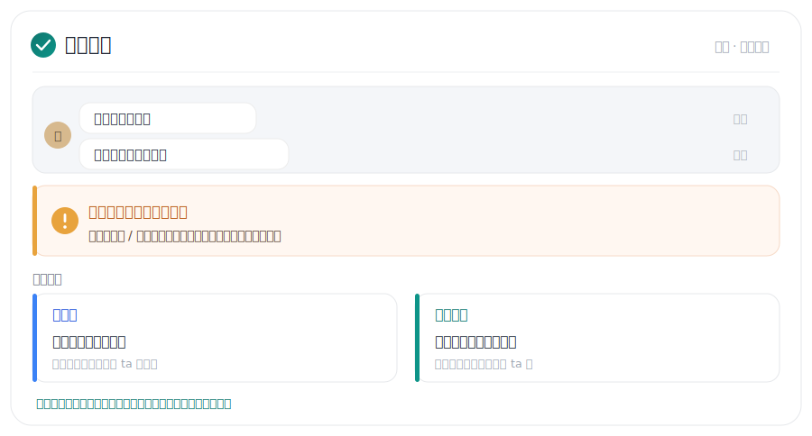
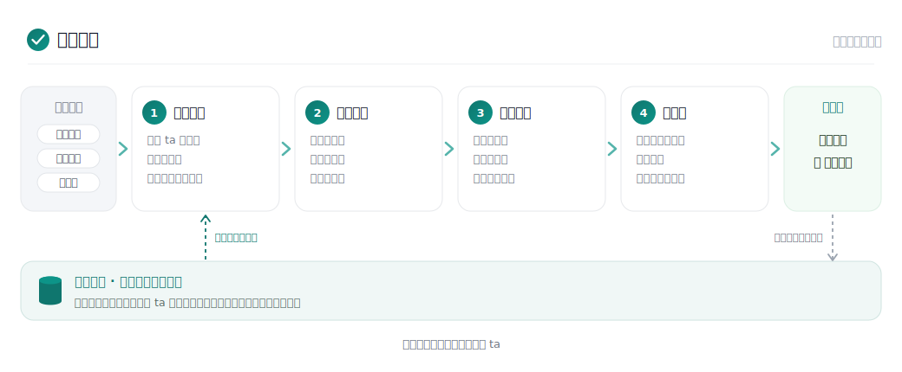

<div align="center">

# 电子军师

### 贴张微信截图，给你三条能直接发的回复。

不会聊、怕翻车、看不懂 ta 什么意思。把聊天丢给它就行。

[](LICENSE)
[](https://claude.ai/code)
[](platforms/codex.md)
[](platforms/chatgpt-instructions.md)
[](README_EN.md)

</div>


> 想直接上手？跳到 [安装与上手](#安装与上手)，跟着一步步粘命令就行，不用懂代码。下面先看它能帮你干嘛。

---

追人最难的地方，常常不是不会说话。

是你拿不准 ta 这句到底有没有戏，是该接着撩还是先停一下，是那句发出去会不会把人吓跑。朋友圈那点暗示该不该接、约成了之后餐厅和花怎么办，又是另一摊事。

电子军师就管这一摊：读你的聊天，告诉你 ta 什么意思、有没有意思，再给你几句拿来就能发、像人话的回复。

它的路子很轴：

> 先把你这个人聊出来，再低油腻地撩。
> ta 接球，就往前走；ta 不接，别硬舔；明显没戏，体面撤。

## 目录

- [它能帮你什么](#它能帮你什么)
- [油腻度是什么](#油腻度是什么)
- [它的路子](#它的路子)
- [安装与上手](#安装与上手)
- [常见问题](#常见问题)
- [运行原理](#运行原理)

## 它能帮你什么

**看一眼聊天，给三条能发的回复**

拆完 ta 那句话的字面、情绪和真实需求，给你三种说法：稳妥版、会撩版、展示自己版。每条都标了油腻度，也就是这段关系现在能甜到几分；超了它自己会压回来，省得你一脚踩进尴尬里。

**ta 到底有没有意思**


主动找你、记得你说过的话、接得住你的梗、愿意见面，加分；长期只回「嗯嗯」「哈哈」、约了又拖、只在需要帮忙时冒头，减分。开了反舔狗模式，这段明显不值得加码的时候，它会直接拉住你，不陪你自我感动。

**对方耍套路，第一时间帮你看穿**



忽冷忽热、画饼、只撩不约、欲擒故纵，这些套路它都认得，会直接告诉你这是套路还是正常拉扯，再给你接得住的走法：不接招，或者收回主动。该你拉扯的时候，它也帮你埋个伏笔，把节奏往你这边带一点。

**约到了，话和提醒分开放**


左边是照着发就行的话，右边是只给你看的旁白：哪天订位、送不送花、西餐怎么点、聊到什么程度可以提下次。两栏分开，省得你手滑把「记得订餐厅」发出去。它也看时间、记日子：你俩的纪念日、生日，加上 520、七夕、情人节这些，会算着还剩几天，提前提醒你订位、备礼。

**同时追几个？各记各的，不串戏**


不是只能盯着一个人。每个对象一份独立档案，阶段、聊天习惯、什么招对 ta 管用，全分开记。每次打开它先问你这次聊谁，选一个或者新建一个，绝不会把小美的事安到阿强头上。

**还顺手帮你**

- **看朋友圈**：截图丢进去，看妆容、穿搭、滤镜、评论区，帮你找切入点。要用能看图的环境，朋友圈一半信息都藏在图里。
- **换窗口也记得 ta**：聊过的、你纠正过的，它都存着，越用越准。新开一个窗口自己接上，不用你从头解释一遍。
- **资料自动分类**：聊天记录、截图、自拍、备注，丢一个文件夹给它，它自己分好，不用你先整理。

## 油腻度是什么

不是不让你甜，也不是不让你撩。它只是提醒你：现在这段关系，信号给太满会不会把人吓跑。

| 阶段 | 大概上限 | 感觉 |
| --- | --- | --- |
| 初识 / 暧昧 | 0–1.5 / 5 | 有意思，但别露底 |
| 追求 / 确认 | 2–2.5 / 5 | 可以主动，别逼问 |
| 热恋 / 稳定 | 3–3.5 / 5 | 可以甜，别腻成复读机 |
| 磨合 / 危机 | 0.5–1.5 / 5 | 先降温，别上头 |

## 它的路子

它帮你把最好的一面亮出来，话说清楚，节奏拿稳：该进就进，该收就收，对方玩什么花样你心里都有数。你才是主角，它只是个参谋。

## 安装与上手

完全没用过也没关系，照着做就行。先挑一条适合你的路。


### 路线 A · Claude Code（装成技能，推荐，能记住每个人）

**第 1 步，装 Claude Code。** 它是个能听懂人话、能读你电脑里截图的 AI 工具。

- Windows：按 `Win + X`，点「终端」（老系统叫「Windows PowerShell」），粘这行回车：

  ```powershell
  irm https://claude.ai/install.ps1 | iex
  ```

- Mac：按 `Command + 空格`，打字「终端」回车打开，粘这行回车：

  ```bash
  curl -fsSL https://claude.ai/install.sh | bash
  ```

  装完按提示用 Claude 账号登录一下（没有就免费注册）。

**第 2 步，把电子军师装成 Claude 的技能（Skill）。** 还在那个窗口里，再粘一行回车，它会装进 `~/.claude/skills/dianzi-junshi`：

- Windows：

  ```powershell
  irm https://raw.githubusercontent.com/shoal-rat/dianzi-junshi/master/install.ps1 | iex
  ```

- Mac：

  ```bash
  curl -fsSL https://raw.githubusercontent.com/shoal-rat/dianzi-junshi/master/install.sh | bash
  ```

**第 3 步，开聊。** 输入 `claude` 回车进去，直接打一句「帮我追个人」。它会问你几个小问题，建好档，然后把微信截图丢给它就行。

> 每步长什么样、卡住怎么办，看[新手指南](docs/新手指南.md)。

### 路线 B · ChatGPT（最省事，什么都不用装）

已经在用 ChatGPT 就走这条，一行命令都不用。照 [platforms/chatgpt-instructions.md](platforms/chatgpt-instructions.md) 把一段说明粘进去就能聊。缺点是换个对话它就忘了，长期记忆不如路线 A。

### 路线 C · Codex

在用 Codex，一行命令克隆到 Codex 的技能目录：

```powershell
git clone https://github.com/shoal-rat/dianzi-junshi.git "$HOME\.agents\skills\dianzi-junshi"
```

（Mac / Linux 把路径换成 `$HOME/.agents/skills/dianzi-junshi`。）更多见 [platforms/codex.md](platforms/codex.md)。

### 装好之后，平时就这么跟它说话

不用记命令，正常打字就行：

```text
（贴一张微信截图）这条我该怎么回
ta 这么说是什么意思，我还有戏吗
我想发「你是不是不想理我了」，行不行
ta 答应周末见面了，帮我安排一下
换个人，帮我新建个对象
```

习惯敲命令的话，`/reply`、`/interest`、`/moments`、`/date-plan` 这些它也都认，记不住也无所谓。

## 常见问题

**我电脑小白，连终端都没用过，能用吗？**
能。照路线 A 一步步粘命令就行，每条都给你写好了。实在不想碰命令，走路线 B 用 ChatGPT，一行都不用敲。

**粘命令报错，或者提示没有 git？**
Windows 先装个 [Git](https://git-scm.com/downloads/win)（下载后一路点下一步），再回到第 2 步重来一遍。还是不行就改走 ChatGPT 那条路。

**装完它不理我，或者找不到？**
把 Claude Code（或 Codex）整个关掉、重新打开一次，新装的技能要重启才认得。然后再说一句「帮我追个人」。还是不出来，就在 Claude Code 里直接打 `/dianzi-junshi` 回车，把它叫出来。

**怎么换对象？同时追好几个会不会乱？**
直接说「换人」或「新建」，它会把你建过的对象列出来让你选。每个人一份档案，各记各的，不会串。

**我的聊天记录安全吗？**
档案只存在你自己电脑上的 `partners/` 文件夹里，默认不上传，删掉就没了。

**它会教我套路、PUA 别人吗？**
不往那个方向带。它帮你把自己最好的一面拿出来、看穿对方的套路、把节奏拿稳，而不是去操控谁。

## 运行原理

它不是把你的话直接丢给 AI 随口编一句。每次都走同一套流程：



1. **读懂场景**：先调出这个人的档案、看现在几点，把聊天里「明确说了什么」摘出来，再开始推断，不瞎猜。
2. **三层解读**：表面说了啥，是什么情绪，真正想要的是什么。
3. **盘算分寸**：ta 到底有没有意思、是不是在套路你、这个阶段能甜到几分。
4. **给你话**：三条能直接发的回复，最后再过一遍「像不像真人会发的」，把套话和机器腔删掉。

每次你发完、给个反馈或纠正，它就把这次写回这个人的档案，所以越用越准，换个窗口也接着记得 ta。

## 你的数据

档案都存在本地 `partners/`，默认不上传（`.gitignore` 已经排除）。删掉某个对象的文件，它的记忆就跟着没了。

## 许可证

MIT，见 [LICENSE](LICENSE)。
