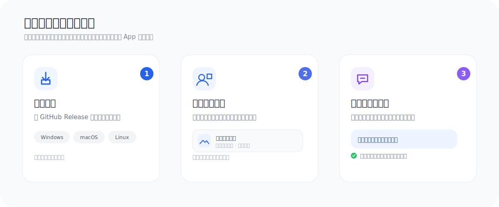
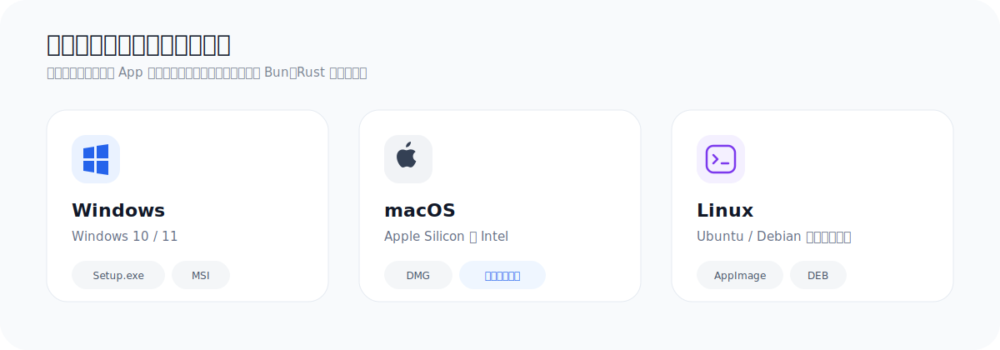
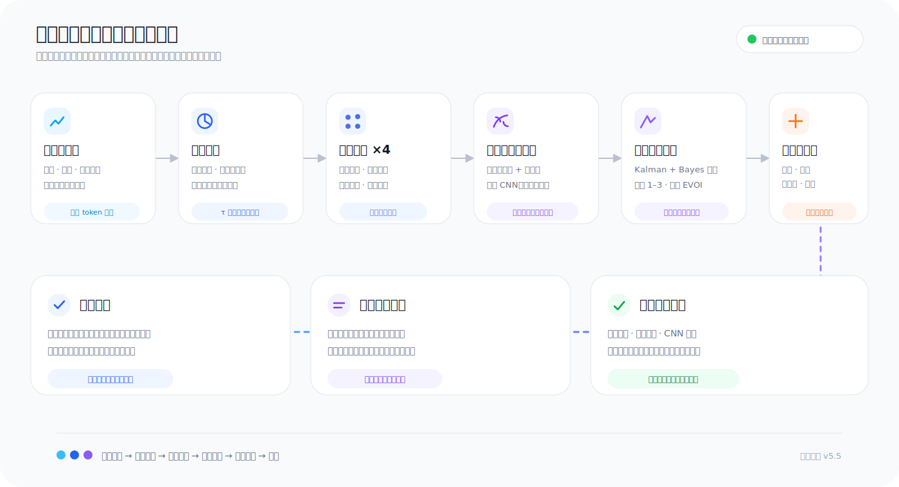
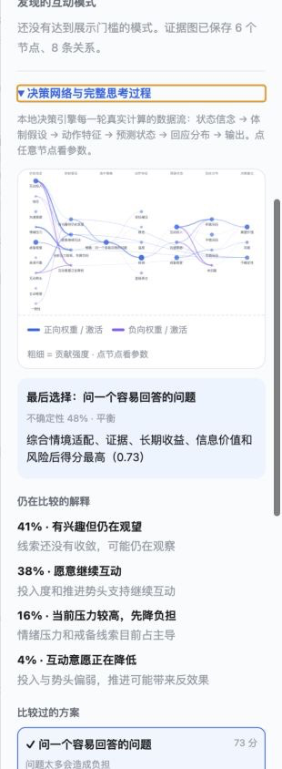
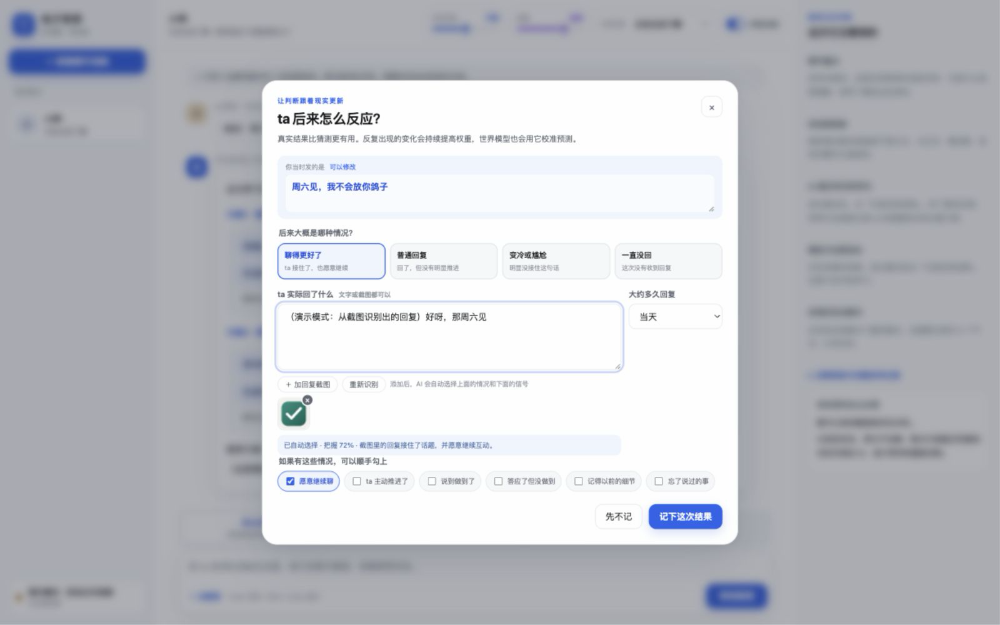

# 电子军师

把聊天贴进来。它先用本地世界模型想清楚，再帮你回——每一步计算都能点开看。

[](docs/releases/v5.6.0.md)
[](desktop/README.md)
[](docs/新手指南.md)
[](app/decision.test.ts)

电子军师是一款桌面聊天辅助应用。你不需要会写提示词，也不需要先整理完整故事。贴一段文字或一批截图，它会找回相关旧资料、比较几种可能解释、用世界模型向前推演几步，再给出能直接发送的说法。资料默认保存在你的电脑上。


## 三步开始



1. 新建一个聊天档案，只填昵称也可以。
2. 贴上聊天文字、截图或以前的资料。
3. 选一句顺口的，复制去发送。

第一次建档时可以一次选择任意数量的截图。应用逐个把文件写入磁盘，再让 AI 一张张整理，内存和模型上下文占用与图片总量无关。进度可以收起，任务仍在后台继续；失败的单张图片可以单独重试。

## 下载与安装

打开仓库的 **[Releases](https://github.com/shoal-rat/dianzi-junshi/releases)** 页面，下载适合电脑的安装包：

- macOS：`.dmg`（Apple Silicon / Intel 分开提供）
- Windows：`setup.exe` 或 `.msi`
- Linux：`.AppImage` 或 `.deb`（x64 / ARM64）

安装包内已经包含应用后端。普通用户不需要安装 Node.js、Bun、Rust 或 Python。

如果当前版本还没有可下载的安装包，可以看 [安装说明](INSTALL.md) 或 [桌面构建说明](desktop/README.md)。Tauri 官方也说明了各平台安装包和签名要求：[Tauri distribution guide](https://v2.tauri.app/distribute/)。

## 不想填 API Key？可以

应用会检查这台电脑上是否已经安装并登录：

- **Codex**：复用现有 `codex login`
- **Claude Code**：复用现有 Claude Code 登录

选中后就能直接使用，电子军师不会读取或保存你的账号密码。本机命令在只读工作区运行；只有本次需要看的截图路径会开放给它。

也可以选择 Claude、DeepSeek、GLM 或自定义 OpenAI 兼容 API。API Key 保存在 macOS Keychain、Windows Credential Manager 或 Linux Secret Service，不写入 JSON 配置。旧版本留下的明文 Key 会在首次桌面启动时自动迁移。演示模式完全离线，用来先熟悉界面。



## 它和普通聊天机器人哪里不同

普通做法常常让一个模型同时读历史、猜状态、选策略、写文案，判断过程混在一次生成里，无法单独检查。

电子军师把这些工作拆开，决策由本地引擎完成，模型只负责最后把话说自然：



## 决策网络：看得见的思考



生成回复时，卡片上就有「看它的决策网络」；回复完成后按钮常驻。点开右侧面板，你看到的是引擎本轮**真实执行的那次计算**，逐层展开：

**状态信念 → 体制假设 → 选中策略 → 动作特征 → 预测状态 → 回应分布 → 输出**

- 节点大小和颜色对应真实激活值（蓝色为正、紫色为负）
- 边的粗细对应贡献强度，权重取自真实系数：信念到假设用打分权重，特征到状态用体制混合增益，状态到回应用响应头载荷
- 点任意节点查看参数：均值与方差、有效样本量、后验概率、该情境的真实学习计数、最强的流入/流出贡献
- 图下方依次是最后选择、仍在竞争的解释、比较过的方案与本轮证据
- 点「⤢ 放大」进入可交互大图：滚轮缩放、拖动平移、点节点看参数，一键复位

顶栏两个滑杆直接控制引擎，按档案分别保存：

- **思考深度**：快速 / 平衡 / 深入，对应推演深度 1/2/3 步与 2/3/4 个体制分支
- **胆量**：五个有名字的档位——很稳 / 偏稳 / 平衡 / 偏敢 / 放胆冲。选的是态度，界面不摆数字；档位重塑目标函数——风险惩罚、推进加成、追问成本、收手门槛都随它变化。滑杆从冷静灰蓝过渡到蓝、紫与橙色，模型的预测本身保持诚实，变的只是你愿意接受的风险

当时序卷积预测器通过保留集门槛后，图中会出现「时序卷积 CNN」节点，标注它的混合权重、参数量、训练样本和保留集优势——它对各回应类别的推拉也画成边。

刷新页面后面板会自动带回最近一次决策；地址加 `#thinking` 可以直接深链到这里。

### 只发截图，也帮你选

不想打字就直接发聊天截图（可以一个字都不写）。读图器先读出对方最后一句、整段对话和语气信号，这些观察进入同一条决策流水线——信念、假设、世界模型推演、批评器——最后照样给你几条能直接发送的说法和推荐理由。中英混排的聊天记录同样认识。

<br clear="right">

## 会记住很久以前的内容

原始消息和截图全程保留。应用使用三层记忆：

1. 最近消息直接保留。
2. 较早内容按当前问题检索。
3. 截图生成带来源的记忆卡，并用本地向量与文字线索找回。

检索前先分词：ICU 词典分词（`Intl.Segmenter`，引擎内建、零依赖、全本机）把「周六那家店订到位子了」切成 周六 / 那家 / 店 / 订到 / 位子，中英混排（「我们Friday见」）同样切得开，字符 n-gram 只作召回补充——BM25 的词频统计落在真实词上。同一套 token 空间也用于向量嵌入；升级时旧素材向量自动重嵌入，一个库里只有一种语义空间。决策证据检索是三路混合：Okapi BM25、384 维特征哈希向量余弦、决策先验（时间、可靠度、重要性、历史用途），用 Reciprocal Rank Fusion 融合，再做嵌入空间去重、类别配额和反证覆盖。时间事实有有效区间；两条可靠信息互相冲突时，两条都会留下。

原文负责完整留存，结构化记忆负责定位，当前上下文只负责本轮决策。近期的 Codex 和 Claude 产品也在使用上下文压缩、外部记忆与主动上下文管理来延长任务，本项目把可回指原文作为最终依据：[Codex compaction](https://openai.com/index/introducing-upgrades-to-codex/)、[Claude context management](https://www.anthropic.com/news/claude-opus-4-5)。


## 从真实结果中学习

点「记录后来结果」，可以告诉它：

- ta 的反应是积极、中性、负面，还是一直没回
- 大约多久回复
- 有没有主动延续
- 约好的事情有没有做到
- 有没有记得以前的细节

「你当时发的是」可以改成最后真正发送的版本。对方的后续也不用手抄：粘贴或加入最多 6 张聊天截图，当前支持视觉的 AI 会自动提取关键回复、选择结果类别和回复时间，并勾选截图里有明确证据的互动信号。界面会显示置信度和理由；所有选择都能修改，只有点「记下这次结果」后才进入学习。



每次结果都会关联当时的决策、策略和实际发送文案。系统分别观察短期变化和长期习惯；新结果的权重更高，旧结果缓慢衰减。单次结果只小幅调整估计，重复出现的结果才形成稳定模式。

所有时间常数都不是全局写死的：引擎按每个档案自己的互动节奏（相邻互动的中位间隔）缩放时钟——天天聊的人用 21/240/120 天的标准半衰期，几天一聊的人自动拉长，反之收紧。同样的信息量由同样多的往来承载，而不是同样多的日历天。

因为每份决策报告都保存了世界模型当时的预测分布，真实结果同时是一份评分数据：引擎会更新对应情境的响应频率、修正状态转移的残差，并持续对比「模型预测」与「基础频率」的对数损失。模型只有在真的比基础频率更准时，学到的参数才占据更大权重。

右侧会显示各类策略的历史样本、带先验的成功估计和最近 30 天趋势。发现的互动模式拥有完整生命周期：样本不足、用于规划、继续观察、暂停使用或不适用。用户可以随时修改，修改结果持久生效。

### 可选的真实结果校准

设置里可以明确选择「帮忙校准本机决策引擎」。它只记录开启之后的新反馈，并且只保存信念数值、假设概率、策略类型、预测分数和结果标签。姓名、档案 ID、聊天原文、回复文案和对方回复都不会进入校准表。校准数据只保存在本机，可以导出审查或一键删除。

## 对不熟悉电脑的人做了什么

- 按钮写「帮我想想」「加截图」「记录后来结果」，不要求理解模型术语。
- 每个弹窗都能用右上角、背景点击或 Esc 关闭。
- 错误信息会告诉你下一步怎么做，并保留刚才输入。
- 第一次只填昵称就能开始，其他资料可以以后补。
- 技术过程默认折叠，重要的不确定性会直接说人话。
- 支持减少动画偏好、键盘操作、清晰焦点和响应式布局。

界面文字遵循短句、日常词、主动语态和任务优先，对阅读困难、电脑经验少或使用翻译工具的人同样友好。参考：[GOV.UK plain-language principles](https://www.gov.uk/government/publications/govuk-content-principles-conventions-and-research-background/govuk-content-principles-conventions-and-research-background)、[Home Office guidance for limited English](https://design.homeoffice.gov.uk/design-and-content/content/designing-for-limited-english)。

## 隐私

- 聊天、截图、索引和结果默认位于 `~/.dianzi-junshi/`。
- 每个聊天对象使用独立目录。
- API Key 使用操作系统凭据库；配置文件只保存「已有 Key」的标记。
- Codex / Claude Code 只读取允许的资料路径。
- 不内置云同步，也不会自动把资料发给仓库维护者。
- 使用云模型时，本轮选中的内容会发送给所选供应商，请同时阅读供应商隐私条款。

SQLite 使用 WAL，让桌面后台整理截图时仍能读取数据；WAL 适合单机并发，不适合把活动数据库放在网络文件系统上。详见 [SQLite WAL documentation](https://www.sqlite.org/wal.html)。

## 开发

需要 Bun 1.3+：

```bash
git clone https://github.com/shoal-rat/dianzi-junshi.git
cd dianzi-junshi/app
bun install --frozen-lockfile
bun run start
```

验证全部后端、前端打包、测试和离线评测：

```bash
cd app
bun run verify
```

当前验证包含 37 个单元与集成测试、一组合成决策情境和一个时序 CNN 对照基准。离线评测不调用模型，也不读取真实用户资料。前端资源在启动时内嵌进服务进程，改动 `app/public/` 后需要重启开发服务器。

桌面开发：

```bash
cd desktop
bun install --frozen-lockfile
bun run dev
```

GitHub Actions 手动触发跨平台安装包构建（macOS、Windows、Linux），生成草稿 Release。正式公开发布前仍应配置 Apple 公证和 Windows 签名证书。

## 文档

- [新手指南](docs/新手指南.md)
- [批量素材与长期记忆](docs/批量素材与长期记忆.md)
- [自适应决策引擎](docs/adaptive-decision-engine.md)
- [本地决策流水线](docs/local-decision-pipeline.md)
- [数据库迁移与回放](docs/database-migrations.md)
- [决策引擎评测](docs/decision-engine-evaluation.md)
- [隐私校准与系统凭据库](docs/privacy-calibration-and-keychain.md)
- [桌面签名、公证与原生 CI](docs/release-signing.md)
- [长期记忆库](docs/长期记忆库.md)
- [v5.6.0 发行说明](docs/releases/v5.6.0.md)
- [更新记录](CHANGELOG.md)

## 技术结构

| 层 | 实现 |
|---|---|
| 桌面外壳 | Tauri 2 |
| 本地服务 | Bun 编译 sidecar + Server-Sent Events 流式响应 |
| 数据 | SQLite WAL + 追加事件 + 版本迁移 |
| 证据图 | 时间节点 + supports / contradicts / precedes / outcome_of 等有效期关系 |
| 分词 | ICU 词典分词（Intl.Segmenter，零依赖）⊕ Han bigram 召回，中英混排一致处理；BM25 与向量嵌入共用一套 token 空间（升级自动重嵌入） |
| 长期检索 | 两阶段：五路广召回（关键词/哈希向量/可选语义向量/人物/日期 + 关联）→ 按问题类型重排 → MMR 多样化 |
| 语义嵌入 | 可选本机模型（自动探测 Ollama 或自定义 OpenAI 兼容端点），与特征哈希混合；缺省零依赖回退 |
| 记忆库 | 结构化事实（类型/置信度/来源/生命周期，短期安排自动过期、持久属性长存）+ 事件聚合 + 截图去重 + 记忆中心（查/改/停用/删 + 检索理由） |
| 决策 | 双时间尺度信念（τ 按互动节奏自适应）、竞争假设、学习型世界模型（体制切换动力学 + 校准响应头 + 信念空间回溯）、模型化 EVOI、多批评器 |
| 决策控制 | 思考深度滑杆（推演深度 / 体制分支）+ 胆量滑杆（风险偏好重塑目标函数，按档案保存） |
| 神经预测器 | 纯 TypeScript 时序卷积网络（1252 参数，本机训练、种子确定），保留集对数损失门控，只在证明更准时参与混合 |
| 可视化 | 每轮决策的分层激活网络（零依赖 SVG），节点可点击审计参数 |
| 学习 | 世界模型响应计数 / 转移残差 / 对数损失门控 + 时间衰减 Beta contextual bandit + 证据用途反馈 |
| 结构化输出 | API 级约束解码（Anthropic 强制 tool schema / OpenAI 兼容 response_format），失败才回退提示修复 |
| 校准 | 明确同意、去标识化、本地导出/撤回、Brier 与分箱校准误差 |
| 读图 | 截图经结构化读取（对方最后一句 + 对话摘录 + 状态信号）进入决策流水线；只发图不打字也能选 |
| 模型 | Codex、Claude Code、Claude、DeepSeek、GLM、自定义 API、离线演示 |
| 前端 | 无框架 HTML / CSS / JavaScript |

## 理论附录：它在优化什么

以下内容完整描述 v5.3 决策引擎实现的数学结构。每个公式都对应仓库中的具体代码（主要在 `app/decision/worldmodel.ts`、`neural.ts`、`state.ts`、`evidence.ts`、`planner.ts`、`store.ts`），不是愿景描述。

### 0. 问题的形式化：部分可观测决策过程

引擎把一段关系中的每次回复决策建模为 POMDP $`(\mathcal{S},\mathcal{A},\mathcal{O},T,Z,r,\gamma)`$：

- 潜状态 $`s\in[-1,1]^9`$：九个关系维度（投入、信任、沟通意愿、情绪压力、戒备程度、承诺可靠、势头、主动、一致性）。真实心理状态不可直接观测。
- 离散体制 $`h\in\mathcal{H}=\lbrace\mathrm{receptive},\mathrm{uncertain},\mathrm{pressured},\mathrm{disengaging}\rbrace`$：同一动作在不同体制下有不同动力学（第 3 节）。
- 动作 $`a\in\mathcal{A}`$：八类策略族，经特征映射 $`\phi:\mathcal{A}\to\mathbb{R}^6`$ 嵌入连续动作空间。
- 观测 $`o`$ 取四个回应类别之一：`positive` / `neutral` / `negative` / `no_reply`，与可记录的真实结果一一对应，因此模型的预测分布可以被后验直接打分（第 8 节）。
- 折扣 $`\gamma=0.68`$，规划视界 $`D\in\lbrace 1,2,3\rbrace`$ 由预算档位决定。

信念是混合形式 $`b=(q(h),\mathcal{N}(\mu,\Sigma))`$：体制上的分类分布乘以对角高斯。理论最优解满足信念空间 Bellman 方程

$$
V_D(b)=\max_{a}\mathbb{E}_{h\sim q}\mathbb{E}_{o\sim Z(\cdot\mid s',h,a)}\left[r(o,b'')+\gamma V_{D-1}(\tau(b,a,o))\right]
$$

其中 $`\tau`$ 是信念更新算子。连续状态加连续信念使精确求解不可行；引擎采用滚动时域近似：根节点对 $`o`$ 做精确枚举分支，深层用确定性等价延拓（第 6 节）。

### 1. 观察融合：异方差遗忘估计与双时间尺度门控

维度 $`d`$ 上的观察 $`x_i`$ 带置信度 $`c_i`$、来源可靠度 $`r_i`$ 与年龄 $`\Delta t_i`$（天）。把每条观察视作异方差高斯测量 $`x_i\sim\mathcal{N}(s_d,\lambda_i^{-1})`$，精度 $`\lambda_i\propto c_ir_i`$，非平稳性用遗忘因子处理：

$$
w_i^{(\tau)}=c_ir_i2^{-\Delta t_i/\tau},\qquad
\mu_d^{(\tau)}=\frac{\sum_i w_i^{(\tau)}x_i}{\sum_i w_i^{(\tau)}},\qquad
\hat\sigma_d^{2}=\frac{\sum_i w_i(x_i-\mu_d)^2}{\sum_i w_i}
$$

$`\mu_d^{(\tau)}`$ 是遗忘加权似然下的 MAP 位置估计；标准档 $`\tau_s=21`$ 与 $`\tau_l=240`$ 天给出两个互补估计器，且两者随档案的互动节奏缩放：以相邻互动的中位间隔 $`g`$（天）定义 tempo $`=\mathrm{clip}_{[1/3,3]}(g)`$，则 $`\tau_s=\mathrm{clip}_{[7,60]}(21g)`$、$`\tau_l=\mathrm{clip}_{[90,480]}(240g)`$，学习半衰期同法取 $`\mathrm{clip}_{[45,360]}(120g)`$——同样的信息量由同样多的往来承载。变化门控是一个硬专家混合：仅当短期有效样本量 $`N_{\mathrm{eff}}^{(s)}=\sum_i w_i^{(\tau_s)}`$ 与偏移 $`|\mu^{(\tau_s)}-\mu^{(\tau_l)}|`$ 同时越过阈值时，短期权重才从 0.38 升到 0.72：

$$
\hat\mu_d=\alpha_d\mu_d^{(\tau_s)}+(1-\alpha_d)\mu_d^{(\tau_l)},\qquad
\alpha_d\in\lbrace 0.38,0.72\rbrace
$$

进入规划前，方差按有效样本量做后验收缩（越多独立证据越确定，但设下界防止对人过度自信）：

$$
\tilde\sigma_d^{2}=\max\left(0.04,\frac{\hat\sigma_d^{2}}{1+0.55N_{\mathrm{eff}}}\right)
$$

### 2. 检索：BM25 与特征哈希嵌入的倒数排名融合

候选证据 $`e`$ 相对本轮问题 $`q`$ 经三路独立排序后融合。词法路是 Okapi BM25（文档频率在候选集内在线计算，$`k_1=1.4`$，$`b=0.6`$）：

$$
s_{\mathrm{lex}}(q,e)=\sum_{t\in q}\ln\left(1+\frac{N-n_t+0.5}{n_t+0.5}\right)\cdot\frac{f_{t,e}(k_1+1)}{f_{t,e}+k_1\left(1-b+b\frac{|e|}{L}\right)}
$$

其中 $`L`$ 是候选集平均文档长度。语义路使用带符号特征哈希嵌入（Johnson–Lindenstrauss 式随机投影草图）：token 经 FNV-1a 哈希落入 384 维中的一个桶，符号由哈希最高位决定，随后做 $`L_2`$ 归一化；相似度取余弦正部。先验路综合时间半衰（120 天）、可靠度、重要性与历史用途后验均值 $`\frac{u+1}{u+v+2}`$（Beta 平滑）。

三路排名用 Reciprocal Rank Fusion 合并（$`k=60`$，权重 $`1,1,0.8`$）：

$$
S(e)=\sum_{r\in\lbrace\mathrm{lex},\mathrm{sem},\mathrm{prior}\rbrace}\frac{w_r}{k+\mathrm{rank}_r(e)}
$$

选择阶段做 MMR 式冗余抑制（与已选证据嵌入余弦大于 0.82 即跳过，反证豁免）、类别配额与反证覆盖，保证进入规划的证据既相关又多样。

### 3. 世界模型 I：体制切换线性高斯动力学

给定体制 $`h`$ 与动作特征 $`\phi(a)\in\mathbb{R}^6`$（soothe、advance、warmth、probe、assert、withdraw），下一状态服从

$$
s_{t+1}\mid h,a\sim\mathcal{N}\left((I-\Lambda)s_t+\Lambda\bar s+G_h\phi(a)+\delta_{h,f},Q\right)
$$

- $`\Lambda=\mathrm{diag}(\lambda_d)`$ 是各维度的均值回复率（情绪压力回复快 $`\lambda=0.30`$，承诺可靠几乎不动 $`\lambda=0.02`$），基线 $`\bar s=0`$；
- 体制增益 $`G_h=M_h\odot G_0+R_h`$：基础增益矩阵 $`G_0`$ 被体制逐列缩放（$`M_h`$），再叠加稀疏带符号修正 $`R_h`$。例如 pressured 体制下 advance 对情绪压力的增益额外 $`+0.30`$、对势头额外 $`-0.24`$——「压力大时推进适得其反」从一句经验变成动力学参数；
- $`\delta_{h,f}`$ 是从真实结果学到的每档案转移残差（第 8 节），以 $`\frac{n}{n+8}`$ 收缩权重生效；
- 协方差沿对角线性传播：$`\Sigma'=(I-\Lambda)\Sigma(I-\Lambda)^\top+Q`$。

### 4. 世界模型 II：校准响应头

回应分布是结构头与经验头的收缩混合。结构头是预测状态上的对数线性模型：

$$
p_0(o\mid s')=\frac{\exp(u_o^\top s'+c_o)}{\sum_{o'}\exp(u_{o'}^\top s'+c_{o'})}
$$

经验头是按（体制, 策略族）分桶、按 120 天半衰期衰减计数的 Dirichlet–多项后验预测（$`\alpha_0=0.75`$）：

$$
\hat p(o\mid h,f)=\frac{n_{h,f,o}+\alpha_0}{\sum_{o'}n_{h,f,o'}+4\alpha_0}
$$

混合闸门随经验证据量增长（$`w=\frac{n}{n+6}`$）：

$$
p(o\mid s',h,f)=(1-w)p_0(o\mid s')+w\hat p(o\mid h,f)
$$

零数据时是纯结构先验，几十条真实结果后经验频率主导——这是小样本条件下唯一诚实的标定方式。

### 4.5 世界模型 III：时序卷积响应预测器

结构头只看得到当前状态的概要，对轨迹形状是盲的——升到 0.5 的投入和从 0.9 降到 0.5 的投入，在概要里是同一个数。v5.3 增加一个小型一维卷积网络直接读原始观测时间线：输入 $`X\in\mathbb{R}^{10\times 16}`$（九个维度按 2.8 天分桶的加权均值，加一条观测密度通道——沉默间隔在这里是信号），两层 valid 卷积（核宽 3，感受野 5 桶约 14 天）：

$$
Y^{(1)}_{c,t}=\mathrm{ReLU}\left(b^{(1)}_c+\sum_{i=1}^{10}\sum_{k=0}^{2}W^{(1)}_{c,i,k}X_{i,t+k}\right)
$$

第二层同构；时间维全局平均池化 $`z_c=\frac{1}{T}\sum_t Y^{(2)}_{c,t}`$ 后拼接动作特征 $`\phi(a)`$ 与体制后验 $`q(h)`$，经两层全连接输出四类 softmax。共 1252 个参数，纯 TypeScript 实现前向与反向传播（反向经数值梯度校验），Adam 优化，种子确定使回放可复现。训练目标是带标签平滑与类平衡权重的交叉熵加 L2：

$$
\mathcal{L}(\theta)=-\frac{1}{N}\sum_{n=1}^{N}\omega_{y_n}\sum_{o}\tilde y_{n,o}\ln p_{\theta}(o\mid X_n,\phi_n,q_n)+\lambda\lVert\theta\rVert_2^2
$$

其中软目标 $`\tilde y`$ 在真实类上取 $`1-\epsilon`$、其余均分 $`\epsilon`$（$`\epsilon=0.06`$），$`\omega`$ 为截断的逆频率类权重。

CNN 只经门控进入决策。按时间顺序留出最后 25% 的真实结果，比较它与当时响应头的保留集对数损失，只有优势超过 0.02 nats 才获得混合权重：

$$
p(o)=(1-w_{\mathrm{nn}})p_{\mathrm{head}}(o)+w_{\mathrm{nn}}p_{\theta}(o),\qquad
w_{\mathrm{nn}}=\min\left(0.5,\frac{n}{n+12}\right)[L_{\mathrm{head}}-L_{\mathrm{cnn}}>0.02]
$$

混合发生在推演树的根节点（真实时间线可得处），逐分支线性实现以保持边际一致；深层延拓与体制似然仍由结构头负责。离线基准（`bun run evaluate`，种子固定可复现）构造「当前概要相同、轨迹形状不同」的序列：CNN 保留集对数损失约 $`0.05`$ nats，概要结构头 $`1.61`$ nats——概要看不出的形状，卷积看得出。数据不足或不比头更准时，$`w_{\mathrm{nn}}=0`$，引擎行为与 v5.2 完全一致。

### 5. 想象观测的信念更新

每个回应类别 $`o`$ 携带观测向量 $`y_o`$ 与观测噪声 $`R_o=\mathrm{diag}(r_{o,d})`$（例如未回复强烈观测到投入与沟通意愿为负）。对角卡尔曼增益逐维更新：

$$
k_d=\frac{\sigma_d'^2}{\sigma_d'^2+r_{o,d}},\qquad
\mu_d''=\mu_d'+k_d(y_{o,d}-\mu_d'),\qquad
\sigma_d''^2=(1-k_d)\sigma_d'^2
$$

同时体制后验按 Bayes 更新——想象中的回应也会改变「哪种解释成立」的信念：

$$
q(h\mid o,a)=\frac{Z(o\mid s_h',h,a)q(h)}{\sum_{h'}Z(o\mid s_{h'}',h',a)q(h')}
$$

这一步让第 7 节的信息价值不再来自启发式：追问的价值恰恰是 $`q(h\mid o)`$ 与 $`q(h)`$ 的差。

### 6. 有限视界值回溯与风险

奖励由回应效用与状态势函数组成：$`r(o,b'')=0.58u(o)+0.42v(\mu'')`$，其中回应效用 $`u`$ 依次取 $`1`$、$`0.55`$、$`0.08`$、$`0.15`$（与结果记录的效用一致），$`v`$ 是线性状态效用叠加压力铰链项：

$$
v(\mu)=\mathrm{clip}_{[0,1]}\left(\frac{1}{2}\left(w_v^\top\mu-0.25\max(0,\mu_{p}-0.5)+1\right)\right)
$$

（$`\mu_{p}`$ 为情绪压力分量。）根节点（深度 $`D`$）对回应精确枚举：

$$
Q_D(b,a\mid h)=\sum_{o}p(o\mid s_h',h,a)\left[r(o,b_o'')+\gamma\tilde V_{D-1}(b_o'',q(\cdot\mid o,a))\right]
$$

深层用确定性等价延拓：在缩减动作集 $`\mathcal{A}_c`$ 上贪心、以期望观测折叠分支：

$$
\tilde V_d(b,q)=\max_{a\in\mathcal{A}_c}\sum_h q(h)\left[\rho(b,h,a)+\gamma\tilde V_{d-1}(\bar\tau(b,h,a),q)\right],\qquad
\tilde V_0(b)=v(\mu)
$$

值按视界质量 $`m(D)=\sum_{k<D}\gamma^k+\gamma^D`$ 归一化到 $`[0,1]`$。每个分支同时给出全方差分解（用于第 9 节的不确定性泛函）：回应随机性的分支内方差加体制分歧的分支间方差，即

$$
\mathrm{Var}=\mathbb{E}_h[\mathrm{Var}_o]+\mathrm{Var}_h(\mathbb{E}_o)
$$

风险直接由模型量给出——负面与未回复概率，加上压力越界的高斯尾概率（$`\Phi`$ 用 Abramowitz–Stegun erf 近似求值；下式 $`p_3`$、$`p_4`$ 分别为负面与未回复概率）：

$$
\mathrm{risk}=0.9p_3+0.7p_4+0.5\Phi\left(\frac{\mu_{p}'-0.6}{\sigma_{p}'}\right)
$$

### 7. 追问的期望信息价值（EVOI）

「是否值得先问一句」按定义计算。以 clarify 为探针动作，枚举其回应类别，经第 5 节的体制 Bayes 更新后重新求最优单步值。第一项是「先问后决策」的期望，第二项是「现在就决策」：

$$
\mathrm{EVOI}=\sum_o p(o)\max_a\sum_h q(h\mid o)Q_1(b_o'',a\mid h)-\max_a\sum_h q(h)Q_1(b,a\mid h)
$$

实际入库值再乘可回答性系数 $`0.5+0.5\min(1,m/3)`$（$`m`$ 为缺失信息条数——用户只能回答确实缺的问题），减去档位相关的提问成本。EVOI 是 $`[0,1]`$ 值域上的绝对改善量，超过 0.02 才生成「先补信息」候选。由 Bayes 更新的凸性可知 EVOI 恒非负（信息永不减少期望值），成本项是让它「值得打扰用户」的那道门槛。

### 7.5 胆量：重塑目标函数的一个标量

界面上的胆量滑杆 $`\beta\in[0,1]`$ 直接改写规划器的目标，而模型本身保持诚实预测：

$$
w_{\mathrm{risk}}(\beta)=0.22(1.45-0.9\beta),\qquad
w_{I}(\beta)=0.12(1.2-0.4\beta),\qquad
c_{\mathrm{ask}}(\beta)=c_0(0.6+0.8\beta)
$$

同时推进类动作获得带符号的情境加成（记 $`\delta=\beta-0.5`$：invite 加 $`0.14\delta`$、direct 加 $`0.09\delta`$、give_space 减 $`0.10\delta`$），探索奖励缩放 $`0.7+0.6\beta`$，弃权门槛移动为 $`0.76+0.28\delta`$。谨慎档提前收手、多问一句；大胆档容忍更高方差、更快出手。同一世界模型，不同风险偏好，各自最优。

### 8. 从真实结果学习：三条同时更新的通道

每份决策报告持久化了当时的预测分布，因此一条真实结果 $`(h^{\star},f^{\star},o^{\star})`$ 同时更新三条通道。

响应计数（Dirichlet 通道，$`\rho=2^{-\Delta t/120}`$，方括号为 Iverson 指示）：

$$
n_{h,f,o}\leftarrow\rho n_{h,f,o}+[o=o^{\star}]
$$

转移残差（Robbins–Monro 通道）：对结果可观测的维度（投入、沟通意愿、势头），以递减步长做带裁剪的随机逼近，残差为观测值与预测均值之差：

$$
\delta_{h,f}\leftarrow\mathrm{clip}_{[-0.5,0.5]}\left(\delta_{h,f}+\eta_n(y_{o^{\star}}-\mu_{\mathrm{pred}}'-\delta_{h,f})\right),\qquad
\eta_n=\frac{1}{\min(24,n+1)}
$$

预测质量门控：模型与基础频率的衰减累计对数损失同时记账，

$$
L_{\mathrm{model}}\leftarrow\rho L_{\mathrm{model}}-\ln p_{\mathrm{pred}}(o^{\star}),\qquad
L_{\mathrm{base}}\leftarrow\rho L_{\mathrm{base}}-\ln p_{\mathrm{base}}(o^{\star})
$$

诊断接口暴露平均优势 $`(L_{\mathrm{base}}-L_{\mathrm{model}})/n`$。学到的参数只通过收缩闸门（第 4 节的 $`\frac{n}{n+6}`$、第 3 节的 $`\frac{n}{n+8}`$）影响规划，因此模型不比基础频率更准时，它对行为几乎没有发言权。

策略层保留时间衰减 Beta 后验作为独立的非平稳 bandit（半衰期 120 天）：

$$
\alpha_t=\alpha_0+\rho_t(\alpha_{t-1}-\alpha_0)+y_t,\qquad
\beta_t=\beta_0+\rho_t(\beta_{t-1}-\beta_0)+(1-y_t)
$$

其后验均值以 0.10 权重进入策略效用，探索奖励 $`\min(0.18,0.16/\sqrt{N+1})`$ 随情境样本量按 UCB 式速率收敛。最终效用是批评器分数的线性标量化：

$$
Q(a)=0.29R_g+0.14R_e+0.13R_c+0.15R_n+0.12I+0.10\frac{\alpha}{\alpha+\beta}+\frac{0.16}{\sqrt{N+1}}-w_{\mathrm{risk}}\mathcal{R}
$$

### 9. 不确定性泛函与弃权

总体不确定性组合五个正交来源——体制熵 $`H=-\frac{1}{\ln K}\sum_k q_k\ln q_k`$、证据冲突率 $`C`$、推演全方差 $`V`$（第 6 节）、证据覆盖 $`G`$、候选分差 $`M`$：

$$
U=0.31H+0.20C+0.19\min(1,5V)+0.18(1-G)+0.12(1-\min(1,6M))
$$

弃权是机会约束式规则：证据条数不足 2，或 $`U`$ 超过随胆量移动的门槛（第 7.5 节）且 $`G<0.42`$ 时，引擎拒绝直接给出回复，转而选可逆的补信息动作。开启校准的用户可以在本机看到 Brier 分数与分箱期望校准误差

$$
\mathrm{ECE}=\sum_b\frac{n_b}{n}|\bar p_b-\bar y_b|
$$

检验这些概率是否名副其实。

### 10. 一句话总结

引擎在有限视界的信念 MDP 上做滚动时域规划：体制切换线性高斯动力学负责「如果我这样回，状态会怎么走」，校准响应头负责「那样的状态下 ta 大概率怎么反应」，卡尔曼与 Bayes 更新负责「看到反应后我该改信什么」，胆量标量负责「我愿意为推进承担多少方差」，而每一条真实结果都在给这些部件对账。所有学习都经过收缩闸门：数据不够时先验说话，数据到位后频率说话。它宁可承认不知道，也不装作看透一个人。

---

MIT License · 欢迎提交 issue、测试案例和改进建议。
