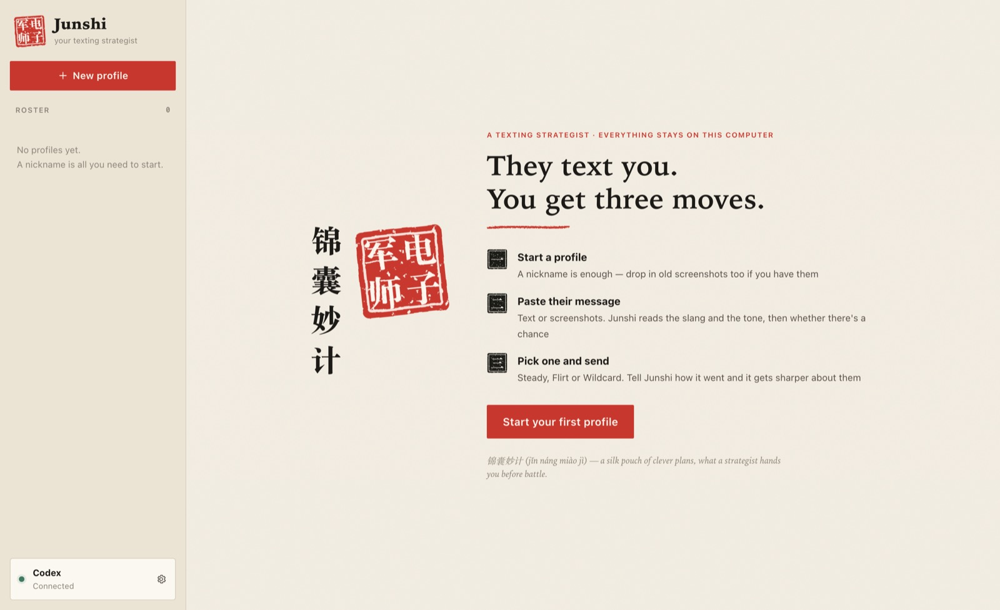
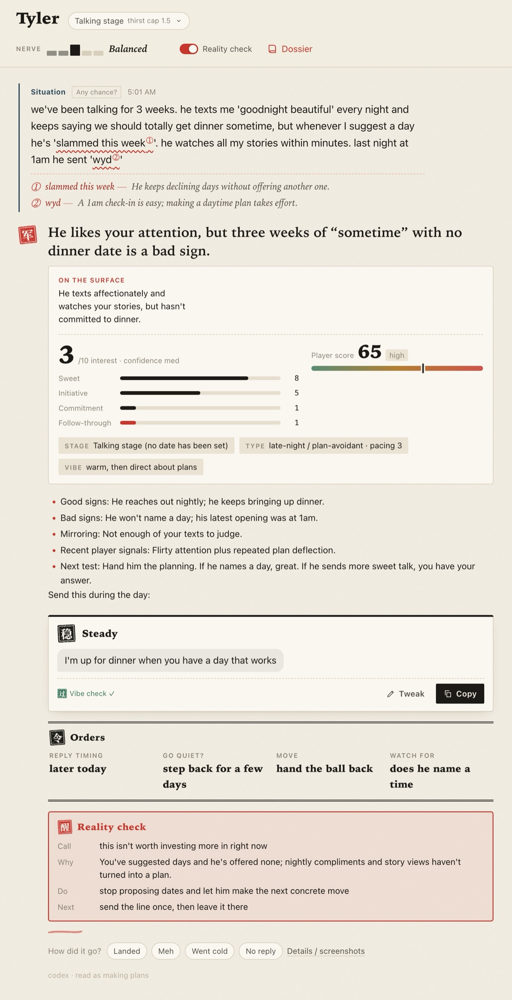
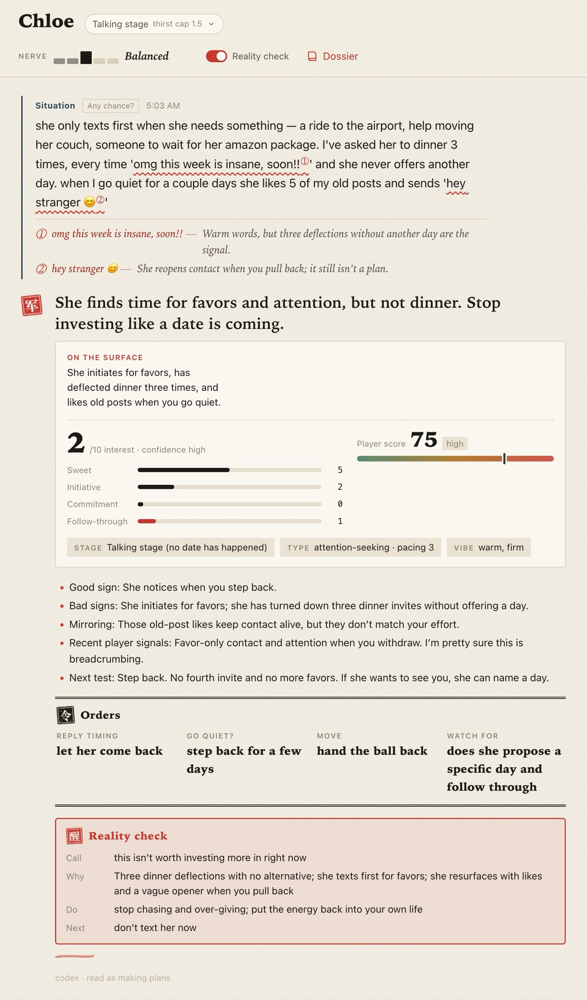
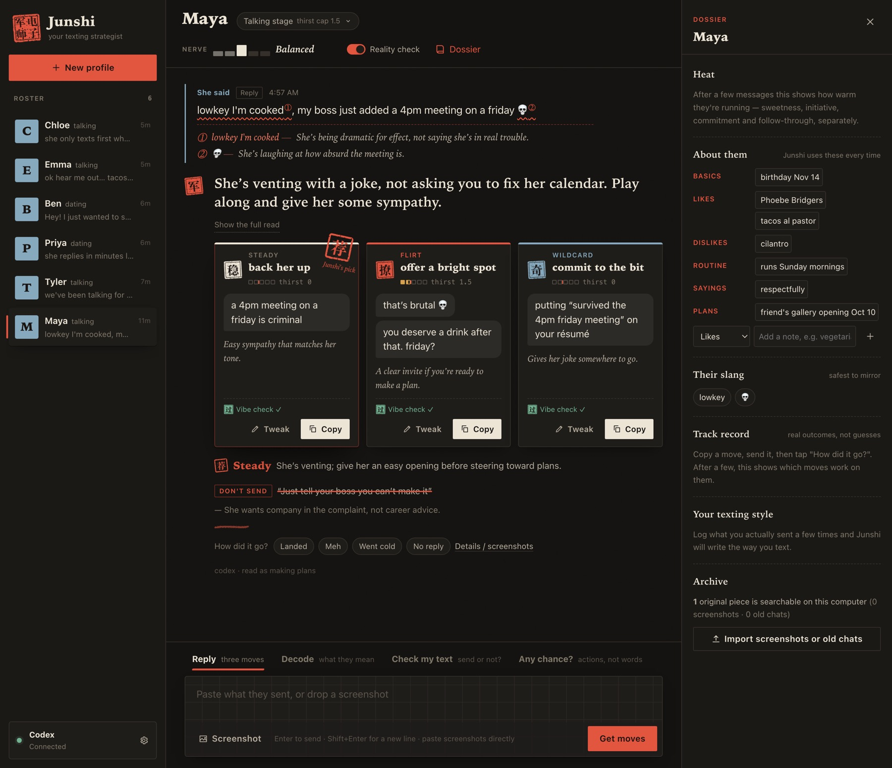

<p align="center"></p>

<h1 align="center">Junshi · 电子军师</h1>

<p align="center">They text you. You get three moves.<br>Junshi reads the slang, the tone and what they actually do, then hands you replies you can send. When someone is just stringing you along, it tells you, the way a good friend would.</p>

<p align="center"><b>English</b> · <a href="README.zh-CN.md">中文</a></p>

<p align="center">
<a href="docs/releases/v6.1.0.md"></a>
<a href="desktop/README.md"></a>
<a href="docs/数据与隐私.md"></a>
<a href="app/test"></a>
</p>


Junshi (电子军师, "the electronic strategist") is a desktop app for the part of dating that happens over text. Paste what they sent, or drop in a screenshot, and it will:

1. **Decode the slang first.** "lowkey I'm cooked 💀" is a bit, not a crisis. Getting the words isn't the same as getting the joke.
2. **Read the room.** What they said, what they feel, what they want from you. Interest is scored on four things separately (sweetness, initiative, commitment, follow-through), and the player score is honest.
3. **Hand you three moves.** Steady, Flirt and Wildcard: three different routes, each written as texts you can copy and send as-is. The one it would pick gets stamped 荐.
4. **Remember them.** Birthday, likes, the slang they use, and which of your moves landed or fell flat.

Everything stays on your computer.

## Getting started

1. Start a profile. A nickname is enough; drop in old screenshots too if you have them.
2. Paste their message or a screenshot and press Enter.
3. Copy a move and send it. Come back and tap **How did it go?** so Junshi learns what works on them.



## Four ways to ask

| Mode | When | What you get |
| --- | --- | --- |
| **Reply** | They texted and you're not sure how to answer | The read, three moves, the pick, and a "Don't send" |
| **Decode** | You just want to know what they meant | Red-ink notes on slang and tone, the three layers, risks, a direction |
| **Check my text** | You've written something and aren't sure about it | Send it / Tweak it / Don't send, a fixed version, and timing |
| **Any chance?** | You've been talking a while and want the truth | Interest on four axes, player score, a next test, orders, and a Reality check if it's needed |

## Steady, Flirt, Wildcard, and nerve

Each move gets a seal:

- **稳 Steady**: safe and solid, easy to walk back.
- **撩 Flirt**: flirty, but never over this stage's thirst cap (0 when you've just met, 1.5 in the talking stage, 3.5 in the honeymoon phase).
- **奇 Wildcard**: the third route the moment calls for. Show who you are, be sincere, be funny, cool it down, or push forward.

Every profile has its own **nerve**: Play it safe, Careful, Balanced, Bold, All in. Nerve changes how much risk you take. The thirst cap moves with it, and the Wildcard goes from "show yourself" all the way to "ask them out, today". The read doesn't change. Interest and the player score are always reported straight.

## Reality check, for players of any gender

Turn on **Reality check** and Junshi judges by actions: sweet texts that never become plans, warmth only after midnight, showing up only when they need a favor, heating back up the moment you go quiet. When the evidence crosses a hard threshold it stamps 醒, tells you to stop investing, and gives you a line to leave with some dignity.

The rules are the same for everyone. Both examples below are real model output.

**A woman asking about a guy**: "goodnight beautiful" every night, "we should totally get dinner sometime", always "slammed this week", and a 1am "wyd".



**A man asking about a girl**: she only texts first when she needs a ride or help moving, three dinners deflected with "soon!!", and a "hey stranger 😊" whenever he goes quiet.



Early on, seeing other people or being on the apps is normal, and Junshi doesn't count it against anyone by itself. It looks at patterns.

## Written for how people text in English

The English version has its own playbook in [`references/en/`](references/en), written for how people text and date in English. It isn't translated from the Chinese one. Chats happen on iMessage, Instagram and Hinge rather than WeChat; "dating" isn't exclusive until you've had the talk; a period at the end of a text reads cold; 😂 reads a little millennial; asking someone out is usually one clean ask, then the ball is in their court. [The English playbook](docs/english-playbook.md) lays out the differences side by side.

Every copyable text goes through a vibe check before you see it. Periods on one-liners, "u up", dead slang, email voice, lecturing and 30-word paragraphs get bounced and rewritten.

| Stiff | Natural |
| --- | --- |
| That sounds nice. | wait that sounds so fun |
| Would you like to go out sometime? | let me take you for a drink this week / thursday? |
| Are you mad at me? | you went quiet on me, did I say something dumb lol |
| Good morning beautiful! Have a great day! ☀️ | good luck today, go crush it |

The slang glossary ([`references/en/glossary.md`](references/en/glossary.md)) works as the scanner and the blacklist at once. Every row carries the month it was last checked: delulu and rizz are in, "it's giving" is on its way out, "on fleek" and "very demure" are gone.

## It remembers them

- **Dossier**: birthday, likes, dislikes, routine, sayings, plans. Each fact notes where it came from, and the whole dossier goes into every request, so nothing gets "forgotten" by a search miss. Edit, pin or delete anything. Plans expire on their own, and a fact you typed yourself is never overwritten by one pulled from a screenshot.
- **Their slang**: words they use themselves. Mirroring them back is the safest move there is.
- **Archive**: old chats and screenshots are kept in full and recalled when they're relevant.
- **Right now**: Junshi knows the date and what's coming up (Valentine's, cuffing season, their birthday) and reminds you to book ahead.

## It learns from what actually happened

Copy a move, send it, then tap **How did it go?**: Landed, Meh, Went cold, or No reply. Or paste their reply screenshot and let Junshi fill it in.

- **Track record**: how often Steady, Flirt and Wildcard have landed with this person.
- **What fell flat**: lines that went cold once aren't suggested again in the same spot.
- **Your texting style**: how long your texts run, whether you use punctuation, lowercase, how you laugh. Moves are written to match.

## Language

- **App language** follows your system: Chinese on a Chinese system, English everywhere else. On Linux it reads `LC_ALL`, `LC_MESSAGES`, `LANG` and `LANGUAGE`; on macOS, your preferred languages. You can override it in Settings.
- **Chat language** is per profile. If you use the app in Chinese but text someone in English, set that profile to English. The moves come out in natural English, built on the English playbook, and the commentary stays in Chinese. Only one playbook is ever loaded at a time.

## Connect an AI

| Connection | Notes |
| --- | --- |
| **Codex** | Uses the Codex you're already signed into (including the one bundled with the ChatGPT desktop app). No key needed |
| **Claude Code** | Uses your Claude Code sign-in |
| **Claude API** | Official SDK, Claude Opus 5.5 by default, with prompt caching |
| **DeepSeek / GLM / custom** | Any OpenAI-compatible endpoint |
| **Demo** | Offline, canned answers to learn the ropes |

API keys live only in your OS keychain.

## Design: red ink on rice paper

The look comes from 朱批, the red-ink notes a teacher writes in the margins. Rice-paper background, ink text, and the strategist's vermilion brush: notes drawn on their words, seals on each move, 荐 on the pick, 醒 when it's time to stop. The seals keep their Chinese characters, and in English each one has a small caption beside it. The dark theme is called Ink night.



## Download

Get it from [Releases](https://github.com/shoal-rat/dianzi-junshi/releases): `.dmg` for macOS (Apple silicon and Intel are separate), `setup.exe` or `.msi` for Windows, `.AppImage` or `.deb` for Linux. The backend is bundled, so you don't need Node, Bun, Rust or Python.

## Develop

With Bun 1.3+:

```bash
git clone https://github.com/shoal-rat/dianzi-junshi.git
cd dianzi-junshi/app
bun install
bun run start
```

```bash
bun run verify
```

`verify` typechecks, runs 77 tests (men and women in the samples, English and Chinese, a fresh temp data folder every run), and compiles the single-file backend. Set `DJ_LANG=en` to force English while developing. The Tauri 2 shell lives in [`desktop/`](desktop).

## Docs

- [The English playbook](docs/english-playbook.md): how the English strategy differs from the Chinese one
- [Data and privacy (Chinese)](docs/数据与隐私.md) · [Design language (Chinese)](docs/设计语言.md)
- [v6.1.0 release notes](docs/releases/v6.1.0.md) · [Changelog](CHANGELOG.md)
