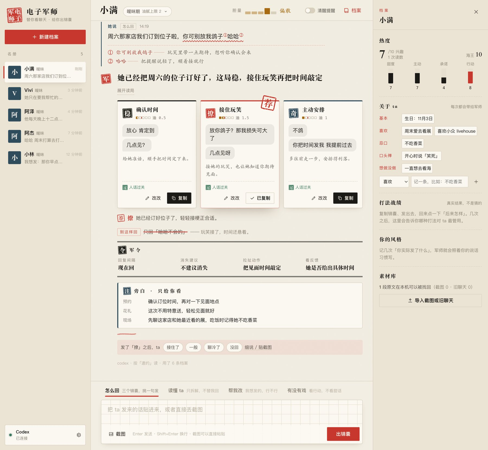
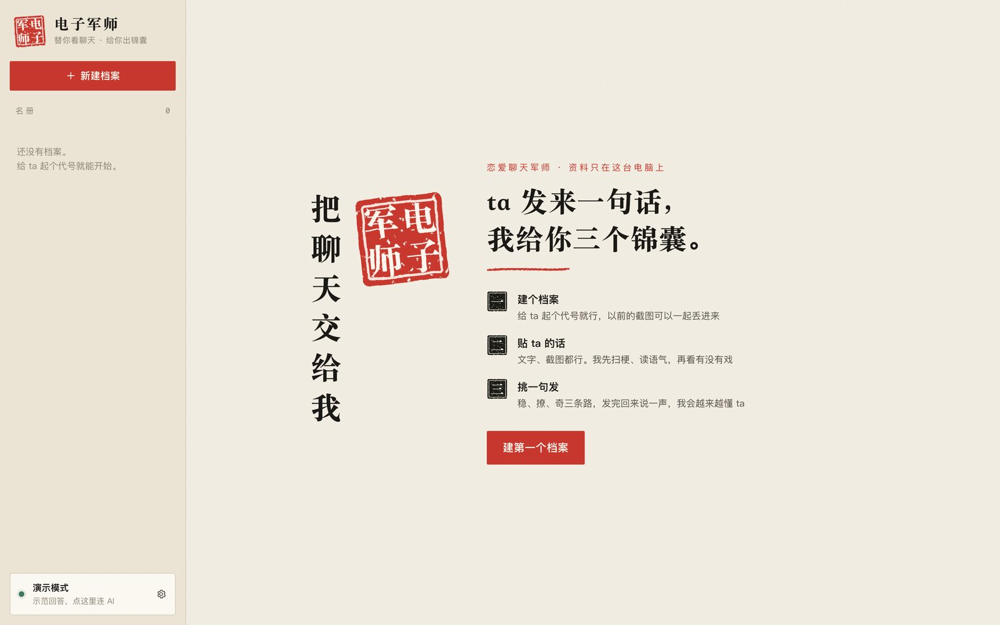
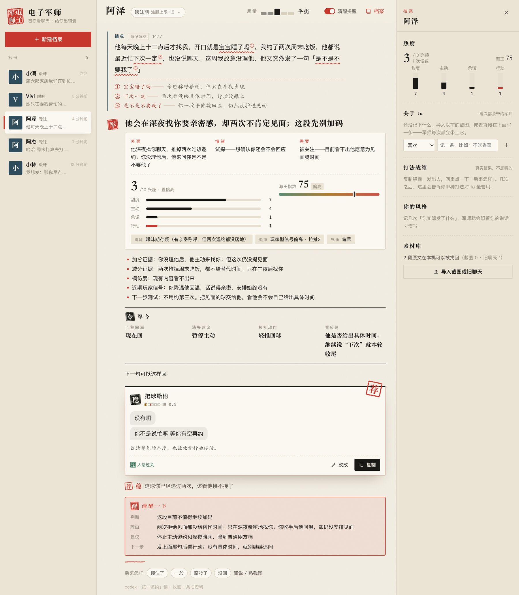
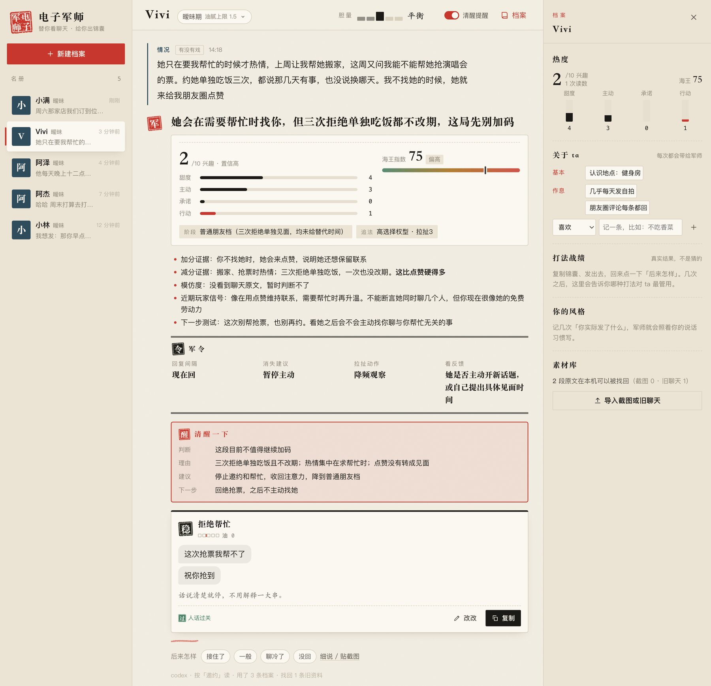
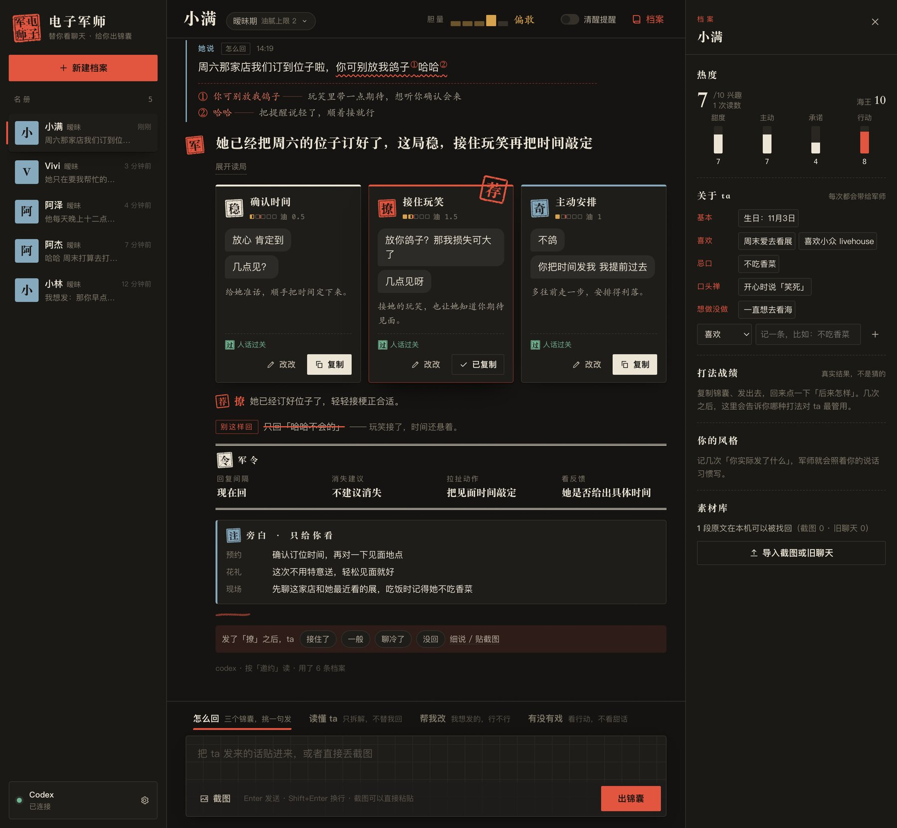

<p align="center"></p>

<h1 align="center">电子军师</h1>

<p align="center">ta 发来一句话，我给你三个锦囊。<br>扫梗、读语气、看行动，替你想好怎么回——明显没戏时，像朋友一样拦住你。</p>

<p align="center"><a href="README.md">English</a> · <b>中文</b></p>

<p align="center">
<a href="docs/releases/v6.1.0.md"></a>
<a href="desktop/README.md"></a>
<a href="docs/数据与隐私.md"></a>
<a href="app/test"></a>
</p>



电子军师是一个装在你电脑上的恋爱聊天军师。把 ta 的话贴进来，或者直接丢聊天截图，它会：

1. **先扫梗**——「那咋了」是撒娇嘴硬，不是生气。看得懂字面不等于懂梗。
2. **再读局**——表面说了什么、情绪是什么、真正要什么；甜度、主动、承诺、行动四项分开打分，海王指数照实给。
3. **出三个锦囊**——稳、撩、奇三条不同的路，每条都是能直接复制发出去的话，还会盖一个「荐」告诉你选哪条。
4. **记住 ta**——生日、忌口、口头禅、ta 用过的梗，以及你在 ta 身上试过的哪招管用、哪句聊冷了，下次都会用上。

聊天、截图和档案都只存在你的电脑上。

## 三步开始

1. 新建一个档案，给 ta 起个代号就行；以前的聊天和截图可以一起丢进来，后台一张张整理。
2. 把 ta 的话贴进输入框，或者直接粘贴截图，按 Enter。
3. 挑一个锦囊复制发出去。发完回来点一下「后来怎样」，军师会越来越懂 ta。



## 四种问法

| 模式 | 什么时候用 | 你会得到 |
| --- | --- | --- |
| **怎么回** | ta 发来一句话，不知道怎么接 | 读局 + 稳 / 撩 / 奇三个锦囊 + 推荐 + 「别这样回」 |
| **读懂 ta** | 只想知道 ta 什么意思 | 梗和语气的朱批、三层解读、风险、回复方向 |
| **帮我改** | 你已经想好一句，拿不准能不能发 | 可以说 / 需要调整 / 不建议，外加改好的版本和时机 |
| **有没有戏** | 聊了一阵，想知道值不值得继续 | 四维兴趣、海王指数、下一步测试、军令，必要时拦住你 |

## 稳、撩、奇，还有胆量

每个锦囊都盖一方印：

- **稳**：稳妥，能进能退。
- **撩**：会撩，但不超过这段关系现在的「油腻上限」（从初识期的 0 到热恋期的 3.5）。
- **奇**：第三条路——展示自己、真诚、整活、降温或者直接推进，看场面。

每个档案有自己的**胆量**，五档：很稳 / 偏稳 / 平衡 / 偏敢 / 放胆冲。胆量改变的是你愿意冒多大的险：油腻上限随之上下浮动，「奇」会从展示自己一路变成直接约、打直球。军师对局面的判断不跟着变——兴趣分和海王指数永远照实给。

## 反海王：男海王、海后都拦得住

打开**清醒提醒**后，军师会按行动证据判断这段关系值不值得继续投入：只撩不约、深夜才热、你降温 ta 回温、只在要帮忙时出现、邀约连续被挡还不给替代时间……命中硬阈值时，它会直接盖一个「醒」，告诉你别再加码，并给出一句体面的收尾话。

同一套标准对男生、女生都一样。下面两张都是真实模型的实际输出。

**女生遇到男海王**：深夜「宝宝睡了吗」、两次「下次一定」、一冷他就回温。



**男生遇到海后**：只在搬家、抢票时热情，三次约饭都「那几天有事」，不找她时就来点赞。



海王指数怎么算、布线 / 保线 / 留鱼三个阶段各有什么表现、有哪些测试动作，见 [问答策略](docs/问答策略.md) 和 [`references/reading.md`](references/reading.md)。

## 朱批：先扫梗，再过人话门禁

- **扫梗**：对方的话先对一遍梗词典（[`references/glossary.md`](references/glossary.md)，每条带校验日期），命中的梗会用朱笔在原话上划线、写旁批。
- **人话门禁**：每条可复制回复都要像 2026 年的年轻人随手打的。句尾句号、「多喝热水」、「你应该」、过气梗、36 字的小作文，都会被打回。句尾句号这类能确定的直接修掉，改不了的交给军师再改一稿。

| 长辈版 | 年轻人版 |
| --- | --- |
| 天冷了，多喝热水，注意保暖。 | 冷死了吧今天 / 给你点杯热的？ |
| 哈哈。是吗？ | 哈哈哈哈哈真的假的 |
| 你是不是不想理我了？ | 你消失得有点彻底 我还以为把天聊死了 |

梗词典同时是扫梗表和黑名单，改一个文件就行。

## 它记得 ta 的事

- **档案卡**：生日、喜欢的、不喜欢的、忌口、作息、口头禅、想做没做的事、约好的安排……每条都注明来源。整份档案每次都带给军师，所以生日不会因为「没检索到」被忘掉。你可以直接改、钉住或删掉。有日期的安排过期后会自动失效；你亲手写的事实，不会被截图里抽出来的说法覆盖。
- **ta 的梗**：ta 自己用过的梗会记下来——镜像回去最安全也最加分。
- **素材库**：旧聊天、截图的原文全部保留，按当前的问题找回（关键词 + 可选的本机语义向量）。
- **此刻**：军师知道今天几号、星期几、离国庆 / 七夕 / 情人节 / ta 的生日还有几天，会提前提醒你订位、备礼。

## 从真实结果里学

复制一个锦囊、发出去，回来点「后来怎样」：接住了 / 一般 / 聊冷了 / 没回。也可以贴 ta 的回复截图，让军师帮你选好。

- **打法战绩**：稳、撩、奇在这个人身上各试了几次、接住几次。
- **聊冷的原句**：聊冷过一次的说法，同样的场面不会再给。
- **你的风格**：你实际发出去的话平均多长、爱不爱打标点、常用哪些语气词，锦囊会照着写。

这些都是真实记录的统计，你可以在档案卡里逐条看到和修改。

## 男生女生都能用

档案里可以写「ta 是男生 / 女生」，设置里可以写「你是男生 / 女生」，都不写也行。写了，军师就会用对「他 / 她」，打法去对应的「追女生 / 追男生」那张表里找；不写就按聊天自己判断，界面统一写「ta」。

## 英文版

v6.1 起有英文版。界面语言跟随系统：中文系统显示中文，其他系统显示英文，设置里可以手动改。

英文版不是把中文策略翻译过去，而是按英语圈的聊天和约会习惯另写了一套（[`references/en/`](references/en)）：聊天在 iMessage、Instagram、Hinge 上；「在约会」不等于确定关系，要专门聊一次才算；一句话末尾加句号显得冷，一个「!」反而显得热情；😂 有点显老；约人讲究约一次、说清楚，然后把球交给对方。梗词典、人话检查、节日（情人节、Galentine's、cuffing season、感恩节）也都是英文那一套。两套策略不会同时塞进上下文：每个档案可以单独设「你们用什么语言聊」，聊英文就只装英文那套；如果界面是中文，解说仍然用中文写，只有锦囊是英文。

印章保留汉字（稳 / 撩 / 奇 / 荐 / 醒），英文界面在旁边配上 Steady / Flirt / Wildcard / Pick / Reality check。

两套策略的差别见 [The English playbook](docs/english-playbook.md)（英文）。

## 连接 AI

| 连接 | 说明 |
| --- | --- |
| **Codex** | 复用电脑上已登录的 Codex（ChatGPT 桌面版自带的也能自动找到），不用填 Key |
| **Claude Code** | 复用已登录的 Claude Code |
| **Claude API** | 官方 SDK，默认 Claude Opus 5.5；问答策略那一大段会被缓存，连着问更省；遇到误拦会自动换模型接着答 |
| **DeepSeek / GLM / 自定义** | OpenAI 兼容接口 |
| **演示模式** | 不联网，用示范回答熟悉界面 |

API Key 只存在系统钥匙串（macOS 钥匙串 / Windows 凭据管理器 / Linux Secret Service）里。

设置里的**想多深**有三档：快 / 标准 / 细。Codex 和 Claude Code 要等整段写完才显示，默认「快」，一般 20–45 秒出结果；遇到吵架、挑明这种关键时刻，可以切到「细」。

## 设计语言：朱批

宣纸打底，墨色写字，朱砂是军师的笔。原话上划朱线、写旁批；锦囊盖印；推荐的那条加盖「荐」；军令用公文的双线框；该拦你的时候盖「醒」。暗色主题叫「墨夜」。详见 [设计语言](docs/设计语言.md)。



## 下载安装

去 [Releases](https://github.com/shoal-rat/dianzi-junshi/releases) 下载：macOS 选 `.dmg`（Apple 芯片 / Intel 分开），Windows 选 `setup.exe` 或 `.msi`，Linux 选 `.AppImage` 或 `.deb`。安装包里已经包含后端，不需要装 Node、Bun、Rust 或 Python。详见 [安装说明](INSTALL.md)。

从 v5 升级：第一次启动时，旧的档案、对话、截图和已经整理好的截图记忆会自动搬进新版本，原文件保持不动；原来存在钥匙串里的 API Key 可以直接用。

## 开发

需要 Bun 1.3+：

```bash
git clone https://github.com/shoal-rat/dianzi-junshi.git
cd dianzi-junshi/app
bun install
bun run start
```

```bash
bun run verify
```

`verify` 会依次做类型检查、跑 77 个测试（男女样本、中英文都有，数据目录每次都是临时的），最后编译出单文件后端。改了 `app/web/` 刷新页面就能看到；改了后端要重启。

桌面版（Tauri 2）：

```bash
cd desktop
bun install
bun run dev
```

## 目录

```text
references/        问答策略（核心 / 语感 / 梗 / 读局 / 打法 / 约会 / 读人 / 梗词典），构建时内嵌进后端
references/en/     英文版问答策略（按英语圈文化另写，不是翻译）
app/server.ts      本机服务（只监听 127.0.0.1）
app/src/core/      扫梗、人话门禁、车道分诊、日历、提示词装配、一轮的流程
app/src/llm/       Codex / Claude Code / Claude API / OpenAI 兼容 / 演示
app/src/store/     SQLite：档案、对话、档案卡、素材库、结果与学习、后台导入、v5 搬家
app/src/shared/    前后端共用：输出契约解析、领域常量
app/web/           Preact 前端（朱批设计语言，中英双语）
app/test/          测试
desktop/           Tauri 桌面壳与打包
```

## 文档

- [问答策略](docs/问答策略.md)——军师怎么想、怎么答，以及 v6 为什么推倒重来
- [设计语言：朱批](docs/设计语言.md)
- [数据与隐私](docs/数据与隐私.md)
- [安装说明](INSTALL.md) · [桌面构建](desktop/README.md) · [发布签名](docs/release-signing.md)
- [The English playbook](docs/english-playbook.md)——英文版的策略和中文版有什么不同
- [v6.1.0 发行说明](docs/releases/v6.1.0.md) · [更新记录](CHANGELOG.md)

