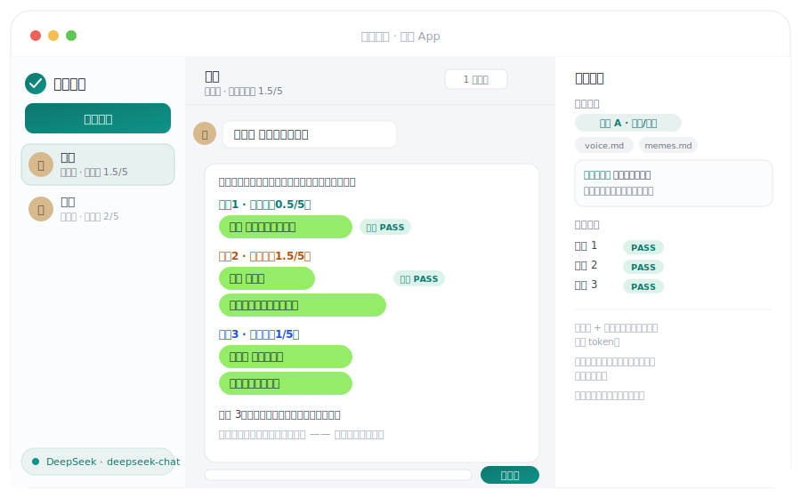

<div align="center">

# Dianzi Junshi

### A Chinese dating-chat agent for people who freeze up, overthink, or cannot read the room.

Paste a chat screenshot. It decodes the memes, judges interest, drafts three send-ready replies that sound like a 2026 twenty-something (never like your uncle), and switches into anti-player push-pull mode when someone looks like a 海王/海后.

[](LICENSE)
[](https://claude.ai/code)
[](platforms/codex.md)
[](README.md)

</div>


## Who It Helps

Use it when you are stuck on:

- Whether their reply actually means anything — or what meme they just used on you.
- How to flirt without sounding oily, needy, or like a middle-aged manager.
- Whether hot-and-cold behavior is normal push-pull or a player pattern.
- What to say once a date is possible.
- Remembering multiple people without mixing up their details.

The default playbook: **show who you are first, flirt lightly, move forward when they catch the ball, pull back when they do not, and switch tactics when the other person looks like a player.**

## What's New in v2

The skill was rebuilt from scratch around two guarantees:

**1. No elder tone, enforced by a machine.** Every copyable reply passes a hard voice gate: `tools/voice_lint.py` blocks sentence-final periods (they read as cold or angry in Chinese chat), "drink more hot water"-style advice, formal connectives, stale memes, and over-long bubbles. Then a self-check list — does it read like something typed casually, does it sound like *you* — with at most two revision rounds. If a draft still fails, it says exactly which check it failed instead of shipping it silently.


**2. It understands memes now.** Every incoming message is meme-scanned first — 「那咋了」 read literally looks annoyed; read as the meme it is, it is playful defiance, and getting that wrong flips the whole reply direction. A bundled, date-stamped meme glossary (fresh / everyday / stale / blacklisted) gets grepped first; unknown memes are web-verified against independent sources and written back with a date, so the glossary grows with use.


Also new: lightweight default output (a 6-character joke no longer arrives inside a 60-line dossier), episode-before-rule memory (one laugh at one tease never hardens into "always tease"), periodic memory compaction (keep conclusions, fold process, archive raw logs), and 25 instruction files consolidated into 8.

## Core Abilities

### 1. Reads the chat, gives send-ready lines

Meme scan first, then a three-layer reading (surface / emotion / real need), then three reply options — safe, flirty, and a third fit to the scene — each with an oiliness score capped by relationship stage, each passed through the voice gate.

### 2. Judges whether they are into you


Interest splits into four dimensions: chat sweetness, initiative, commitment, and meet-up/action follow-through — because sweet talk only counts as sweet talk; actions decide. v2 adds the mimicry signal: when they start copying your particles, phrasing, and stickers, that is the strongest measurable interest evidence in chat-log studies. Anti-simp mode pulls you back when the numbers say stop.

### 3. Anti-player mode


It watches classic hot-and-cold plus platform-era signals: template-perfect emotional value, flirty comment sections, Moments bait, multi-line scheduling, holiday-only heat. A 0-100 confidence score triggers concrete test actions: back off and observe, push the ball back into time-and-place, off-schedule tests, exclusive-detail tests.


### 4. Different types, different plays

Direct, slow-burn, aesthetic/ritual, social-butterfly, high-option player — typed from chat and Moments evidence, each with a pull intensity 0-3. Underneath, a personality baseline decides the persona channel: edgy (痞) or gentle (乖), always amplifying a side you actually have, never a fake persona. Paste in any line you saw on a short video and it calibrates it to the stage, their vibe, and your voice.

### 5. Reads Moments and social screenshots properly

Full-resolution originals only, one structured record per image (who initiated, counter-questions, invites, cooling signals), conclusions traceable to image IDs — no "vibes from many pictures."

### 6. Keeps date replies and private reminders apart


Copyable replies contain only what you can send. User-only reminders carry the rest: booking lead times, flowers by stage, holiday calendars, and an experience-design note for one memorable moment per date.

### 7. Per-partner long-term memory that stays lean


Isolated profiles per partner; episode-before-rule learning (2-3 consistent episodes before anything becomes a standing rule); a "never again" list quoting the exact messages that killed conversations; and periodic compaction that keeps conclusions, folds process, and archives raw logs — so profiles get smarter, not fatter.

## How It Thinks


Scan memes (loop 1: glossary → web → cache) → read the situation → pick the play (stage caps, pull intensity, persona channel) → draft three options → voice gate (loop 2: lint + checklist, max two revisions) → deliver → your feedback writes back to memory (loop 3: episodes before rules, periodic compaction).

## Desktop App (Claude / DeepSeek / GLM)

Prefer a WeChat-style window, or want to use DeepSeek or GLM (Zhipu) instead of Claude? Run the desktop app: partner list on the left, three send-ready replies in the middle, a strategist panel on the right showing the routed lane, loaded modules, meme scan, and voice-gate results live.



```bash
git clone https://github.com/shoal-rat/dianzi-junshi.git
cd dianzi-junshi/app
bun start          # install Bun first: curl -fsSL https://bun.sh/install | bash
```

Click the pill at the bottom-right to pick a provider and paste an API key (leave it as demo mode to preview the flow first). Supports **Claude, DeepSeek, GLM (Zhipu)**, and any OpenAI-compatible endpoint. Run `bun run build:app` for a double-click single-file executable.

Engineering notes: meme scanning and the voice gate run deterministically on the local server (zero tokens); the skill layer is a stable prompt prefix served from cache (Claude prompt caching / DeepSeek prefix caching), so continuous use only pays for the delta; Bun runs zero-dependency and `--compile`s to one file; API keys and chats live only in `~/.dianzi-junshi`, never in the repo. See [app/README.md](app/README.md).

## Setup (Claude Code)

**Route A · Claude Code (recommended).** Install Claude Code, then paste into it:

```text
帮我把这个skill安装到claude code，让我可以开关：https://github.com/shoal-rat/dianzi-junshi
```

Then just say 「帮我追个人」 and drop in a WeChat screenshot.

**Route B · Codex.** See [platforms/codex.md](platforms/codex.md).

## Everyday Use

No commands needed — talk normally, paste screenshots. If you prefer commands: `/reply`, `/interest`, `/moments`, `/date-plan`, `/anti-simp on`, `/memory compact`.

## License

MIT, see [LICENSE](LICENSE).
