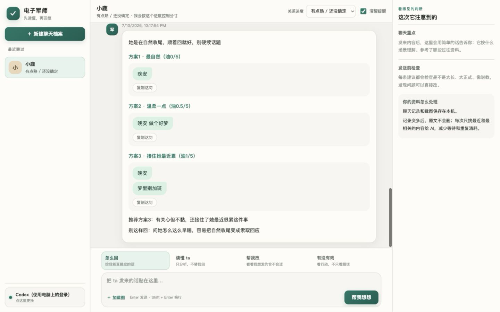

<div align="center">

# Dianzi Junshi / 电子军师

A local-first desktop assistant for understanding Chinese dating chats and drafting natural replies.

[](docs/releases/v5.1.0.md)
[](#download)
[](README.md)

</div>



## Download

Open the [latest GitHub Release](https://github.com/shoal-rat/dianzi-junshi/releases/latest) and choose:

| System | Installer |
| --- | --- |
| Windows 10/11 | `setup.exe` (or MSI for managed deployment) |
| Apple Silicon macOS | DMG containing `aarch64` |
| Intel macOS | DMG containing `x64` |
| Ubuntu / Debian | DEB |
| Other Linux | AppImage |

End users do not need Bun, Node.js, Rust, or a database server. See [INSTALL.md](INSTALL.md) for signing and first-run notes.

## Desktop-first architecture

Version 5 is a full desktop decision product, not an agent-skill installation. A small Tauri 2 window launches a compiled Bun sidecar on a random localhost port. The installer contains everything the app needs and stops the sidecar when the window exits.

The app can reuse an existing Codex or Claude Code login without storing another API key. It can also connect to Anthropic, DeepSeek, GLM, or an OpenAI-compatible API.

## Deep and evolving memory

- Batch screenshot selection has no artificial count cap; files stream to disk and are processed one at a time.
- Persistent jobs expose progress, survive restarts, and retry individual analysis failures.
- SQLite WAL stores memory cards, outcome events, and temporal profile observations.
- `sqlite-vec` accelerates local KNN search where native extension loading is supported; exact cosine search is the safe fallback.
- Retrieval combines vector similarity, lexical overlap, importance, weak recency, and related-memory links.
- Original text and screenshots remain available because no summary is truly lossless.

After sending a suggested reply, the user can record what actually happened. The app learns bounded strategy weights and keeps separate short-term and long-term estimates for responsiveness, initiative, follow-through, remembering details, and warmth. Old evidence decays; repeated outcomes increase confidence; recent divergence is presented as change, not as a rewritten permanent personality.

This design is informed by [PersonaMem](https://arxiv.org/abs/2504.14225), [Memoria](https://arxiv.org/abs/2512.12686), [A-MEM](https://arxiv.org/abs/2502.12110), [RAPTOR](https://proceedings.iclr.cc/paper_files/paper/2024/hash/8a2acd174940dbca361a6398a4f9df91-Abstract-Conference.html), [sqlite-vec](https://alexgarcia.xyz/sqlite-vec/), and [Tauri 2](https://v2.tauri.app/).

## Storage and security

Data remains under `~/.dianzi-junshi/` by default. The HTTP sidecar only listens on a random `127.0.0.1` port. Local CLI agents receive minimal read access, and screenshots are sent to the chosen model only when their analysis job runs. API keys use macOS Keychain, Windows Credential Manager, or Linux Secret Service and are never written to the JSON settings file.

## Development

```bash
cd app
bun install
bun run verify

cd ../desktop
bun install
bun run build
```

Pushing a `v*` tag runs the cross-platform release workflow and creates a draft GitHub Release with Windows, macOS, and Linux installers. See [desktop release instructions](docs/发布桌面安装包.md) and the [v5.1.0 notes](docs/releases/v5.1.0.md).

Version 5 added an event-sourced decision pipeline with temporal beliefs, competing hypotheses, decision-oriented retrieval, independent critics, uncertainty-aware abstention, linked outcome learning, replay, and offline evaluation. Version 5.1 replaces the static simulation table with a learned generative world model: regime-switching linear-Gaussian latent dynamics, a calibrated response head (structural softmax shrunk against decayed Dirichlet–multinomial outcome counts), diagonal-Kalman belief updates on imagined responses, finite-horizon belief-space rollouts, an exactly-computed expected value of information for clarifying questions, and online learning gated by predictive log-loss against base rates. Evidence retrieval is now hybrid (Okapi BM25 ⊕ feature-hashed embeddings ⊕ Reciprocal Rank Fusion), and structured LLM calls use API-level constrained decoding with prompt-repair only as a fallback. The full mathematical specification is in the README theory appendix; release details in the [v5.1.0 notes](docs/releases/v5.1.0.md).

## License

MIT, see [LICENSE](LICENSE).
