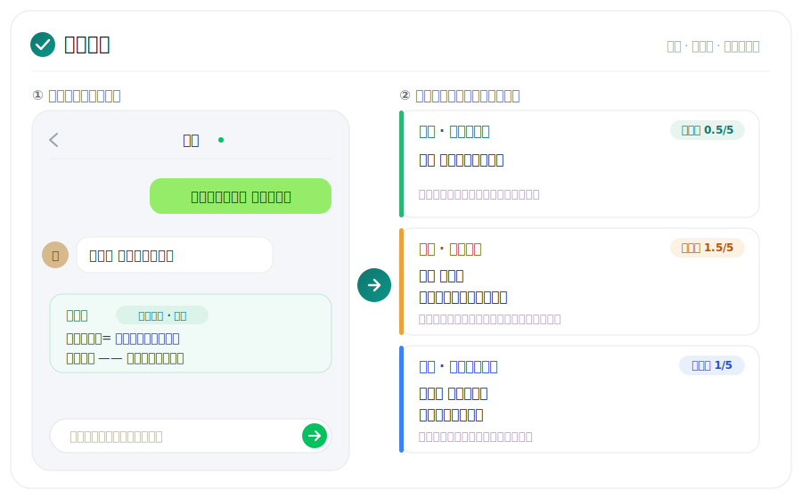
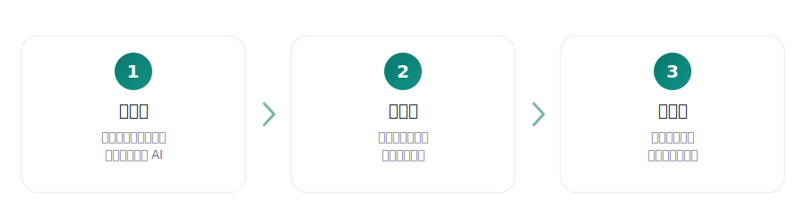
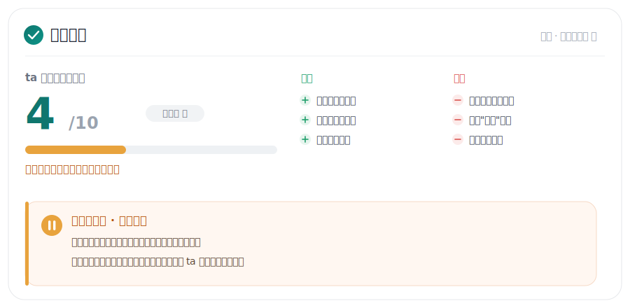
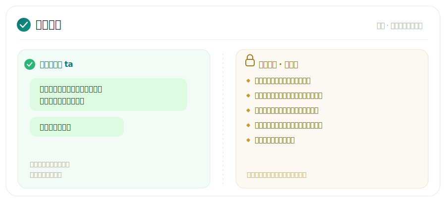
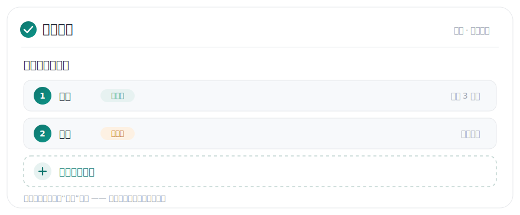

<div align="center">

# Dianzi Junshi

### Paste a chat screenshot, get three replies you can send right now.

For people who freeze up, who worry about saying the wrong thing, who can't read what the other person actually means.

[](LICENSE)
[](https://claude.ai/code)
[](platforms/codex.md)
[](platforms/chatgpt-instructions.md)
[](README.md)

</div>



---

The hard part of chasing someone usually isn't the words.

It's not knowing whether that reply means anything, whether to flirt back or pull away, whether the line you want to send will scare them off. Their Moments feed, the restaurant, the flowers once they say yes. Each one is its own puzzle.

Dianzi Junshi handles that. It reads your Chinese chats, tells you what they mean and whether they're into you, then hands you a few short replies that sound like a person instead of a script.

The approach is stubborn and simple:

> Show who you are first, then flirt lightly.
> They catch it, move forward. They don't, stop pushing. Clearly no, leave cleanly.

## Three steps



1. **Install once** — one command, into the Claude Code, Codex, or ChatGPT you already use.
2. **Talk** — say "help me with someone I like," answer a few small questions, and it builds the profile itself.
3. **Send a screenshot** — drop in a WeChat screenshot or a chat log, get replies back.

No command list to memorize. You talk normally; it knows what you want.

## What it does

**Reads the chat, gives you three replies**

It breaks down what they literally said, the feeling under it, and what they actually want, then gives three versions: safe, flirty, show-yourself. Each one carries an oiliness score (how sweet this stage can take), and anything over the line gets pulled back down for you.

**Whether they're actually into you**



Starting conversations, remembering what you said, catching your jokes, agreeing to meet — points up. Endless "haha," dodged plans, showing up only when they need a favor — points down. Turn on anti-simp mode and when a thread clearly isn't worth more effort, it tells you to stop rather than cheer you on.

**Once you have a date, replies and reminders stay apart**



The left column is text you can send as-is. The right is for your eyes only: when to book, whether to bring flowers, how to order, when it's fine to float a next time. Kept apart so you never paste "remember to book the table" by accident.

**Chasing more than one? Each stays separate.**



You're not stuck with one person. Everyone gets their own profile (stage, chat habits, what actually works), all kept apart. Each time you open it, it asks who you're on about and lets you pick or start a new one, so it never mixes up one person's notes with another's.

**And along the way**

- **Reads Moments** — drop in screenshots; it looks at makeup, outfit, filters, and comment threads to find openers. Use a setup that can see images; half of a Moments feed lives in the pictures.
- **Remembers across windows** — one local profile per person, sharper the more you use it. A new window picks up where you left off, no re-explaining.
- **Sorts a folder for you** — chat logs, screenshots, selfies, your own notes; point it at a folder and it sorts them, no prep on your end.

## Oiliness

Not about banning sweetness or flirting. It's a reminder: at this stage, would too strong a signal scare them off?

| Stage | Rough cap | Feel |
| --- | --- | --- |
| Just met / flirting | 0–1.5 / 5 | interesting, don't show your hand |
| Pursuing / confirming | 2–2.5 / 5 | be active, don't push for an answer |
| Early / stable | 3–3.5 / 5 | sweet is fine, don't loop |
| Friction / crisis | 0.5–1.5 / 5 | cool down first |

## Install once

Claude Code / Codex on macOS or Linux:

```bash
curl -fsSL https://raw.githubusercontent.com/shoal-rat/dianzi-junshi/master/install.sh | bash
```

Windows (PowerShell):

```powershell
irm https://raw.githubusercontent.com/shoal-rat/dianzi-junshi/master/install.ps1 | iex
```

Or one line by hand, into the Claude Code personal skills folder:

```bash
git clone https://github.com/shoal-rat/dianzi-junshi.git "$HOME/.claude/skills/dianzi-junshi"
```

ChatGPT can't read your local files — setup is in [platforms/chatgpt-instructions.md](platforms/chatgpt-instructions.md).

## Then just talk

Open Claude Code or Codex; it first asks who you're talking to (pick one or start a new one), then you just talk:

```text
help me with someone, set up a profile
(paste a screenshot) how should I reply to this
what does this mean, do I still have a shot
I want to send "are you ignoring me" — should I
they said yes to the weekend, help me plan it
new profile, there's someone else now
```

It works out whether to analyze, draft, or tell you to back off. If you like commands, `/reply`, `/interest`, `/moments`, and `/date-plan` all work too. You just don't need them.

## How it plays

It helps you show your best self, say things clearly, and keep your pacing. No games and no tug-of-war; that stuff is cheap and it doesn't work. You're the lead; it's only the advisor.

## Your data

Everyone gets their own profile, stored locally in `partners/` and uncommitted by default (`.gitignore` already excludes it). Delete a person's file and their memory goes with it.

## License

MIT. See [LICENSE](LICENSE).
