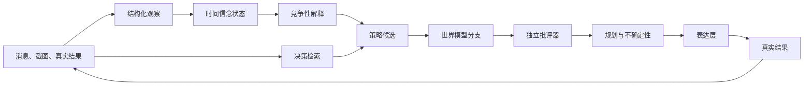

# 自适应决策引擎

电子军师 v5 不再把一整段历史交给模型，然后期待它一次完成观察、判断、选策略和写文案。决策与表达现在是两条明确分开的路径。

## 一次请求里发生什么

1. `message.observed` 作为不可变事件写入 SQLite。
2. 观察器只提取有证据支持的状态信号，并保存来源、时间、可靠度和置信度。带截图时，读图器先读出对方最后一句、对话摘录和图中信号，一并进入观察层。
3. 信念层分别计算短期与长期半衰期的统计量（标准档 21/240 天，按档案互动节奏自适应缩放）。近期变化不会抹掉长期历史。
4. 引擎同时保留“愿意继续互动”“仍在观望”“压力较高”“正在退出互动”等解释，并给出概率和反证。
5. 检索层从近期记录、较早消息、截图记忆和结果记录里挑证据。先经 ICU 词典分词（bigram 召回补充），BM25、特征哈希向量余弦与决策先验三路排名经 Reciprocal Rank Fusion 融合，再做冗余抑制与类别配额；相关度从来不是唯一标准。
6. 策略生成器提出 3 到 8 个可执行方案。学习型世界模型对每个方案做信念空间推演：体制切换线性高斯动力学预测状态变化，校准响应头给出四类回应的概率，想象中的回应经卡尔曼与 Bayes 更新继续向前推 1 到 3 步。
7. 目标、证据、一致性、自然度、信息价值和风险由独立批评器评分。风险来自模型量本身：负面与失联概率，加上压力越界的高斯尾概率。
8. 规划器在 `快速 / 平衡 / 深入` 三种预算下选择策略。证据不足时，它会追问或收住，而不是装懂。
9. 最后一个模型调用只负责把已经选定的策略写成自然中文。

观察、事实、决策、策略与结果同时进入时间证据图。下一轮检索会带回图中高可靠节点和反证；模式只有处于 `active` 生命周期时才会调整策略分数。

## 状态不是性格标签

每个维度都保存：

- 均值与方差
- 置信度
- 短期值与长期值
- 有效样本量
- 证据引用
- 是否过期、冲突或正在变化

当前维度包括互动投入、信任、沟通意愿、情绪压力、边界敏感、承诺可靠、互动势头、主动程度和一致性。所有数值都是可修正的状态估计，不是对人的永久定义。

## 学习如何保持克制

策略学习使用带时间衰减的 Beta 后验。学习只改变排序，不会把一种策略变成永远正确的规则。一次结果会更新：

- 与本次决策关联的策略后验
- 本次使用证据的历史用途
- 时间信念观察
- 世界模型：对应（体制, 策略族）的响应计数、转移残差，以及模型对基础频率的对数损失优势
- 时序 CNN：按时间序重训并重新做保留集对照，只有保留集优势超过门槛才参与根节点混合
- 结果事件与可回放审计记录

世界模型学到的参数只经收缩闸门生效：没有数据时规划完全由结构先验驱动，几十条真实结果之后经验频率才逐渐主导。诊断接口可以查看模型是否真的比基础频率预测得更准。

探索奖励会随样本增加而收缩。用户仍能看到其他候选以及没选它们的原因。

历史面板使用同一批结果计算每种策略的时间衰减 Beta 后验、有效样本量、30 天趋势和正负结果数。显示分数带先验收缩，避免把一次成功画成 100%。

## 失败与降级

结构化模型调用具有 JSON 提取、常见格式修复、一次重试、模式校验、缓存和确定性回退。供应商不支持结构化输出或模型失败时，本地观察器、模拟器和批评器继续工作。演示模式完全离线。

## 代码边界

| 模块 | 职责 |
|---|---|
| `decision/types.ts` | 显式领域类型 |
| `decision/store.ts` | 事件、事实、投影、世界模型学习、回放、缓存和诊断 |
| `decision/tokenize.ts` | ICU 词典分词 ⊕ bigram 召回，n-gram 回退 |
| `decision/evidence.ts` | 观察提取与 BM25 ⊕ 向量 ⊕ RRF 混合检索 |
| `decision/state.ts` | 时间状态、假设、变化和模式 |
| `decision/worldmodel.ts` | 体制切换动力学、响应头、卡尔曼更新、rollout 与 EVOI |
| `decision/neural.ts` | 纯 TS 时序卷积响应预测器：前向/反向、Adam、观测网格特征化 |
| `decision/planner.ts` | 策略生成、批评器、奖励、不确定性和选择 |
| `decision/pipeline.ts` | 阶段编排与表达契约 |
| `decision/structured.ts` | 结构化 LLM 适配：原生约束解码优先，修复回退 |
| `decision/evaluation.ts` | 离线合成评测 |

原始事件是可回放的事实来源；信念、后验与用途权重是可以重建的投影。
