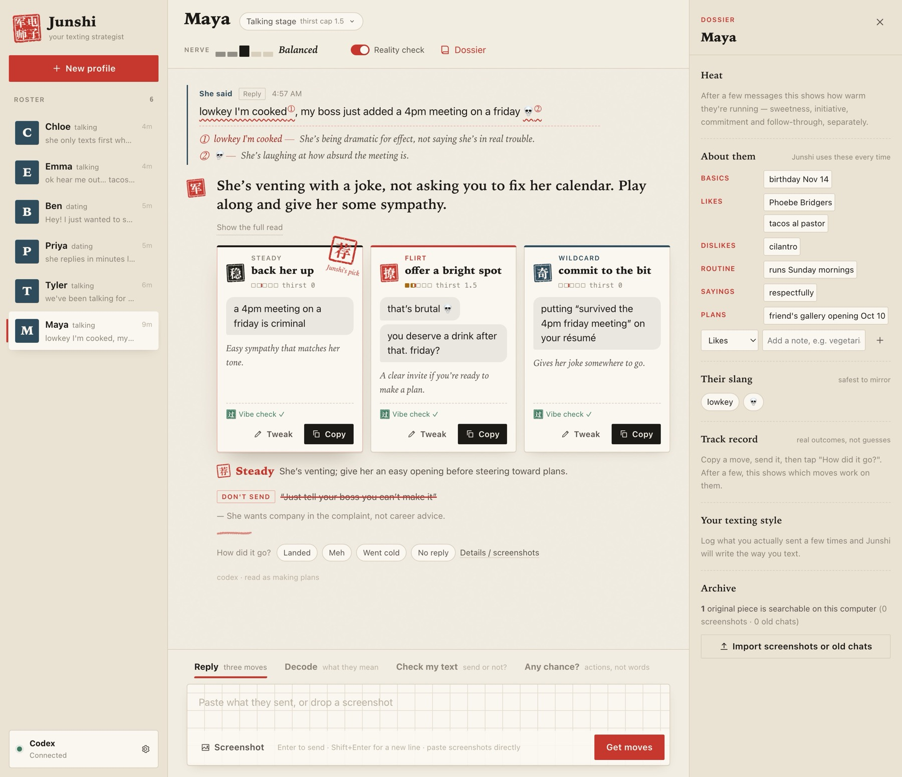

# 🀄 Junshi · 电子军师 v6.1.0 · English

Junshi now speaks English. The app follows your system language (English outside Chinese locales), and English chats get their own playbook, written for how people text and date in English.

## What's new

- **English UI, following your system language.** On Linux it reads `LC_ALL` → `LC_MESSAGES` → `LANG` → `LANGUAGE`; on macOS, your preferred languages; on Windows, the system locale. Chinese locales stay Chinese; everything else falls back to English. Override it in Settings → App language. Existing v5/v6 installs keep Chinese.
- **A separate English playbook** (`references/en/`), not a translation: iMessage / Instagram / Hinge instead of WeChat; talking stage → dating (not exclusive by default) → DTR; a period on a one-liner reads cold, one "!" reads warm; one clean ask, then the ball is in their court; being on the apps early isn't a player signal on its own; Valentine's, Galentine's, cuffing season, Thanksgiving. See [The English playbook](../english-playbook.md).
- **Only one playbook in context.** Each profile has a chat language (defaults to the app language). English chats load only the English playbook, slang glossary and vibe check. With a Chinese UI and an English chat, the moves come out in English and the commentary stays in Chinese.
- **English slang glossary with check dates**: delulu, rizz, aura, cooked, crash out, the ick, breadcrumbing, beige flag, hardballing and more; aging and dead lists (it's giving → on fleek, YOLO, very demure). Everyday words that are also slang ("cooked", "bet", "mid") aren't auto-flagged, so "I cooked dinner" stays unannotated.
- **An English vibe check** on every copyable text: trailing periods, "k", "u up", dead slang, email voice and lecturing get rewritten; 🙂, 😂, "!!", trailing "..." and "good morning beautiful" get flagged.
- **Still 朱批.** Rice paper, ink and the vermilion brush; the seals keep their characters, with English captions (稳 Steady · 撩 Flirt · 奇 Wildcard · 荐 Pick · 醒 Reality check). Headings are set in an old-style serif, notes in italics.
- **Desktop**: the window title and Linux package descriptions follow the language.
- **Fix**: a turn that was still being written when the app closed used to stay blank forever. It's now marked as interrupted on the next launch, with a hint to ask again.

## 中文摘要

- 新增英文版：界面语言跟随系统，中文系统仍是中文，其他系统默认英文；设置里可以手动切换。老用户保持中文。
- 英文版的问答策略按英语圈文化另写了一套（`references/en/`），不是翻译；梗词典、人话检查、节日都是英文那一套。
- 两套策略不会同时进上下文：每个档案可以单独设聊天语言，界面中文、聊天英文时，锦囊用英文写，解说仍是中文。
- 设计语言不变，印章保留汉字，英文界面配英文名。
- 修复：App 在回答写到一半时被关掉，那一轮会一直空着；现在下次启动会标成「没答完」，提示重新问。

## Verification

- `bun run verify`: typecheck, 77 tests (23 new: 22 for English — contract parsing, vibe check, slang scan, lanes, calendar, doctrine isolation, locale detection, catalog hygiene, with men and women in the samples — and 1 for the interrupted-turn fix), single-file compile.
- Live runs on Codex with the English playbook: banter reply, a woman asking about a male player, a man asking about a female player (both trip Reality check with the same rules), Check my text, and Chinese UI with an English chat.
- `cargo check` of the Tauri shell.

---

Junshi gives texting advice. Whether and what you send is always up to you.
