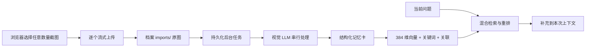

# 批量素材与长期记忆：实现说明

这份说明面向维护 App 的开发者，记录 v3.1.0 的关键取舍。

## 数据流



## 为什么不是一个超大的上传请求

旧实现把所有图片转成 Base64，放进一个 JSON 请求。图片数量增长时，浏览器会同时持有 `File`、Data URL 和 Base64 字符串，服务端又要一次解析整个 JSON，峰值内存远大于原始文件。

新实现对每个文件发送独立的二进制请求。服务端读取 `ReadableStream` 并写入 `Bun.file().writer()`，完成一张后才继续下一张。批量大小因此主要受磁盘约束，而不是一次请求的内存峰值。

## 为什么模型也要逐张处理

- 视觉模型对单次图片数量和总像素都有供应商限制。
- 一张图失败时，只需要重试这一项。
- 每完成一张就能写入索引，长批次有增量价值。
- 进度可以准确表达，而不是长时间停在一个不透明的“处理中”。

任务状态保存在 `partners/{slug}/material-jobs/{jobId}.json`。状态包括 `queued`、`waiting-for-ai`、`running`、`complete` 和 `partial`。服务启动或 AI 连接改变时，会寻找可继续的任务。

## 记忆卡

视觉模型必须输出 JSON。字段包括：

```json
{
  "summary": "简短摘要",
  "facts": ["可回指原图的事实"],
  "keywords": ["检索词和同义概念"],
  "people": ["称呼或人物"],
  "dates": ["时间线索"],
  "sentiment": "情绪或互动状态",
  "importance": 0.0,
  "retrievalText": "面向未来查询的语义描述"
}
```

`retrievalText` 不替代原图。它的作用是把图中事件换成未来用户可能使用的说法，例如把“Livehouse”扩展到“现场音乐、演出、约会地点偏好”。

## 向量与重排

为了保持零运行时依赖和单文件构建，当前版本没有下载独立 embedding 模型。它对 LLM 已经语义扩展过的 `retrievalText` 做中文二/三元组和英文词的 feature hashing，得到 384 维归一化向量。

最终分数：

```text
0.56 × 向量余弦相似度
+ 0.27 × 关键词重合
+ 0.14 × 重要度
+ 0.03 × 时间新近度
```

时间权重刻意很低。这样能找回很久以前的明确约定、偏好或关系转折，而不是总让最近的普通闲聊占满结果。

每条新记忆还会连接到最多 4 条相似旧记忆。直接命中的记忆可以带回相关邻居，形成一个轻量的本地记忆图。

## 后续可以升级的方向

- 可选的本地多语种 embedding 模型，并保留当前 feature-hash 作为离线降级。
- 对大批记忆做 RAPTOR 风格的阶段/事件簇摘要。
- 用真实查询日志建立检索评测集，调整混合权重，而不是靠主观感觉。
- 为任务队列加入暂停、取消、重新排序和磁盘空间预估。
- 对重复截图做感知哈希去重。

任何升级都应保留两个原则：原图不因摘要而删除；检索结果要能回到来源核对。
